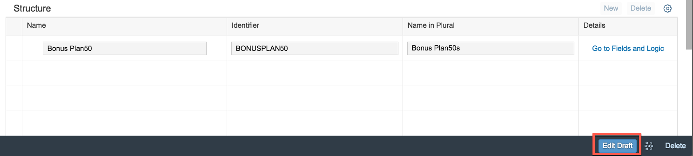
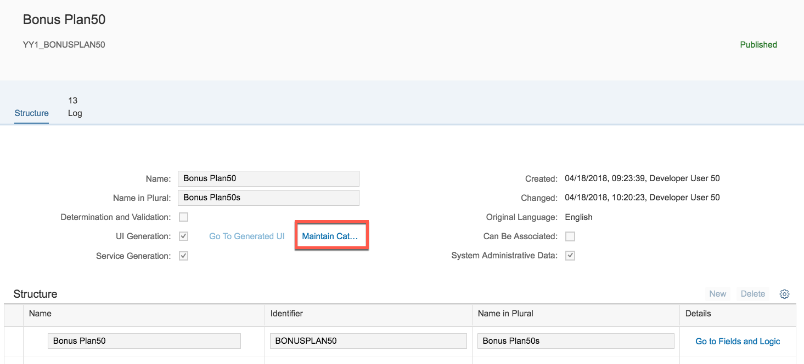
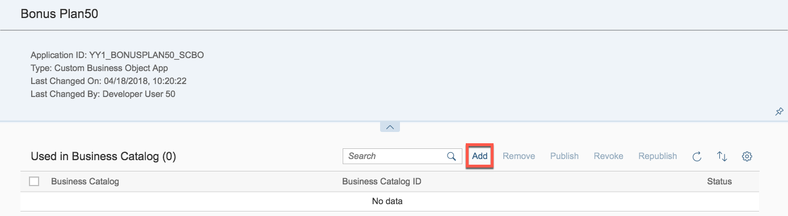
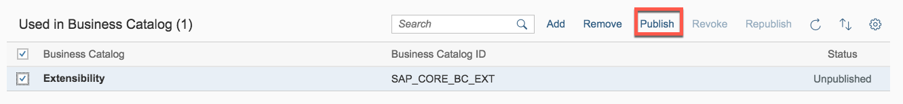
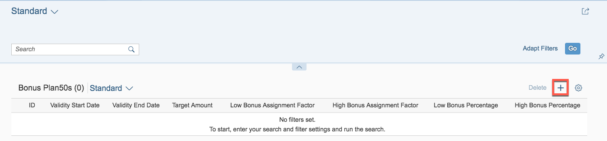
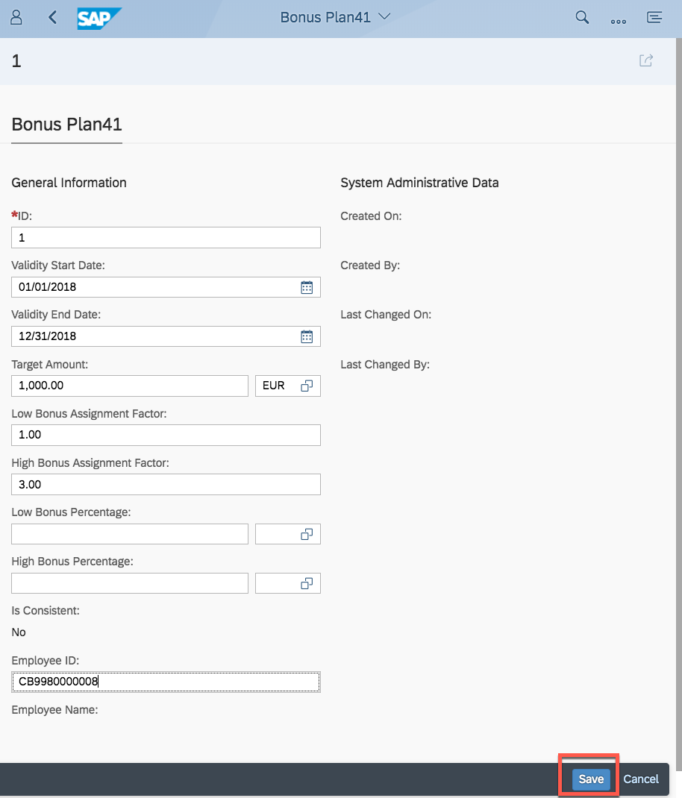
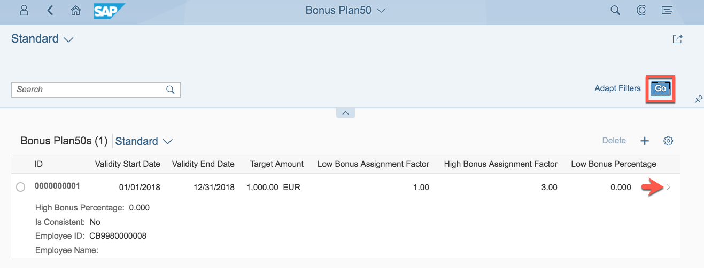
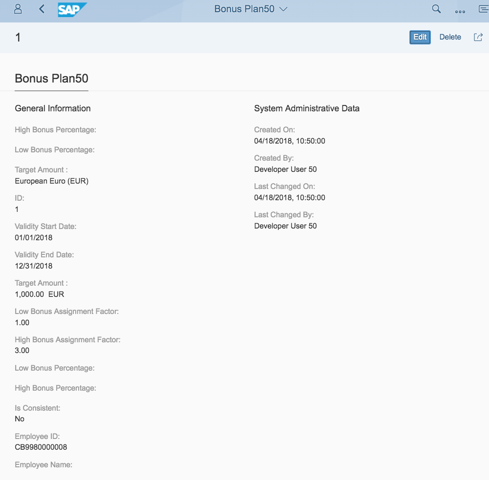

<table width=100% border=>
<tr><td colspan=2><h1>EXERCISE 1_2 - CREATE A UI FOR A CUSTOM BUSINESS OBJECT</h1></td></tr>
<tr><td><h3>SAP Partner Workshop</h3></td><td><h1> &nbsp;15 min</h1></td></tr>
</table>

## Description
In this exercise, you’ll learn how 

* to create an own application based on a Custom Business Object and a Custom Catalog Extension

For further reading on S/4HANA cloud in-app extension, click link below.
<https://jam4.sapjam.com/groups/m8lprEZwfU3zPoX0myj1Xu/overview_page/RfBJ6ix9q00bbSseaxm4zW>

## Target group

* Developers
* People interested in learning about S/4HANA Cloud extension and SDK  

## Goal

The goal of this exercise is to create UI for a custom business object.

## Prerequisites
  
Below are the prerequisites for this exercise.

* Google Chrome: Please complete this exercise using the Google Chrome browser
* **Authorizations:** Your user needs a business role with business catalog **Extensibility** (ID: `SAP_CORE_BC_EXT`)

## Steps

1. [Start Editing Custom Business Object Bonus Plan](#start-editing-custom-business-object)
1. [Generate UI](#generate-ui)
1. [Expose UI as Application](#expose-ui-as-application)
1. [Open Bonus Plan application](#open-bonus-plan-application)
1. [Test Bonus Plan application](#test-bonus-plan-application)

###  Start Editing Custom Business Object Bonus Plan

A several tutorials spanning example will show extensibility along custom Bonus Management applications.

In the first parts a Manager wants to define business objects "Bonus Plan" for employees. A Bonus Plan is there to save employee specific rules for bonus entitlement.

1. **Start** the Custom Business Object's application by clicking its tile 

	
1. **Search** for Custom Business Object "PlanXX" (1+2) and **open** its details by clicking its list item in the search result list (3). Note: XX is the number assigned to you.

1. To be able to do changes to the lastly published version of the business object you need to start edit mode by executing the **Edit Draft** action. 
 
###  Generate UI

1. **Check** the two boxes for UI Generation and Service Generation.  
1. **Publish** the business object to trigger the generation of UI (Master and Detail) and OData Service.

###  Expose UI as Application

1. Now you make the UI available as SAP Fiori Launchpad application by assigning it to a Business Catalog which corresponds to a group in Launchpad. 
1. From the Business Object's overview go to Custom Catalog Extension application by clicking the **Maintain Catalogs** action.  
1. A new window will open. 
1. Start adding a catalog with the **Add** action.  
1. In the opening value help narrow down the result list by searching for `Extensibility`, select the Catalog with role ID `SAP_CORE_BC_EXT` and press **OK**.  

	 
1. **Select** the just added Catalog and **Publish** it.  
1. Click OK for the Confirmation.  

	
1. This step takes some minutes (5 to 11 minutes), the screen refreshes automatically and once the status switches from unpublished to published, you can close this application's window and proceed.  

	

###  Open Bonus Plan application

1. Back in the Custom Business Object application's window, go to the SAP Fiori Launchpad via **Home** action.

	  
1. **Refresh** the Browser window with key **`F5`** for that the catalog extension becomes visible. Now there is the Bonus PlanXX application's tile in the **Extensibility** group.
1. **Start** the application by clicking its tile.  

	

###  Test Bonus Plan application

1. **Open** the Bonus PlanXX application.
1. **Create** an object by clicking the "+".

	
1. **Enter** following data

	| Field | Value |
	| :------------- | :--------------------------- |
	| ID | 1 |
	| Validity Start Date | 01/01/2018 |
	| Validity End Date | 12/31/2018 |
	| Target Amount | 1000.00 EUR |
	| Low Bonus Assignment Factor | 1 |
	| High Bonus Assignment Factor | 3 |
	| Employee ID | `<any>` |

1. Employee ID <any> shall be the one of a sales person that created sales orders with a Net Amount of more than 3000.00 EUR in 2018 and that are completed. In this exercise, you can use CB9980000008. 
1. **Save** the Bonus Plan. The UI will automatically return from Bonus Plan Detail to Master.
1. Click on **Go**.  You can see one entry in the list of bonus plans now.  

	
	
	
	
## Summary

This concludes the exercise. In the preceding tutorials you created a custom business object with a simple data structure and its persistence. Afterwards you generated an UI for this business object and exposed it as an Fiori Launchpad application.
As the generated User Interfaces only list all fields of a business object node, adapting the UI might be necessary to improve usability of it.

Please proceed with next exercise.