<table width=100% border=>
<tr><td colspan=2><h1>EXERCISE 1_7 - CREATE CUSTOM FIELDS - READ ONLY</h1></td></tr>
<tr><td><h3>SAP Partner Workshop</h3></td><td><h1> &nbsp;30 min</h1></td></tr>
</table>

## Description
In this exercise, you’ll learn how 

* to createto create Custom Fields at a standard business object and add them to its UI.
In the example a product manager wants to maintain a bonus percentage and validity period at the product to increase its sale.

As there are two ways to create custom fields, the tutorial shows both separately.

Method 1: Custom Field – via extensible Application (Product)

This way is easier, if you have no information about the business context and data source of the UI you want to add a field to initially.

Method 2: Custom Field (Product) – via Extensibility Application

This way is faster, if you know business context and UI data source, especially, if you want to create several fields. If you want to add a custom field to several UIs you only can enable them for all in the explicit extensibility application.

For further reading on S/4HANA cloud in-app extension, click link below.
<https://jam4.sapjam.com/groups/m8lprEZwfU3zPoX0myj1Xu/overview_page/RfBJ6ix9q00bbSseaxm4zW>

## Target group

* Developers
* People interested in learning about S/4HANA Cloud extension and SDK  

## Goal

The goal of this exercise is to create custom fields at a standard business object.

## Prerequisites
  
Below are the prerequisites for this exercise.

* Google Chrome: Please complete this exercise using the Google Chrome browser
* **Authorizations:** Your user needs a business role with business catalog **Extensibility** (ID: `SAP_CORE_BC_EXT`)
* To be able to open and adapt the UI of the **Manage Product Master Data** application your user needs business catalog `SAP_CMD_BC_PR_MAINT_PC`.

## Steps

####Method 1: Custom Field – via extensible Application (Product)

1. [Creating a Custom Field and adding it to the UI](#creating-custom-field)
1. [Testing Custom Field Data](#testing-custom-field-data)

####Method 2: Custom Field (Product) – via Extensibility Application

1. [Creating and Enabling UI Usage of a Custom Field](#creating-and-enabling-ui-usage)
1. [Creating a Second Field](#creating-second-field)
1. [Adapting the UI](#adapting-the-ui)
1. [Testing Custom Field Data](#testing-custom-field-data-2)

####Method 1: Custom Field – via extensible Application (Product)

To calculate a product related bonus, the standard business object “Product” gets a custom field for Bonus Percentage

###  Creating a Custom Field and adding it to the UI

1. Open the **Manage Product Master Data** application

	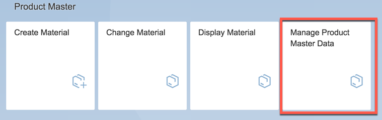

1. Execute **GO** action to get the list of products.
	
	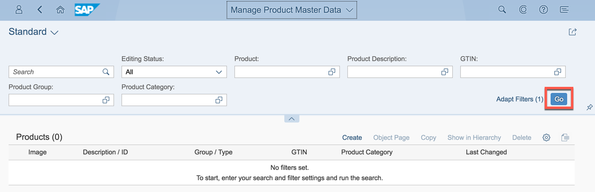
	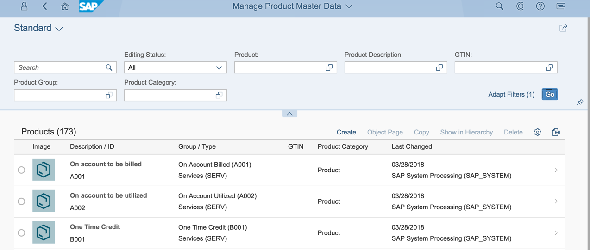

1. Enter Detail screen of a product that is used in a bonus relevant sales order.

	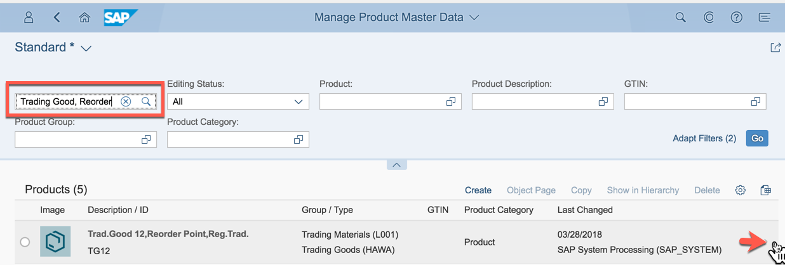
	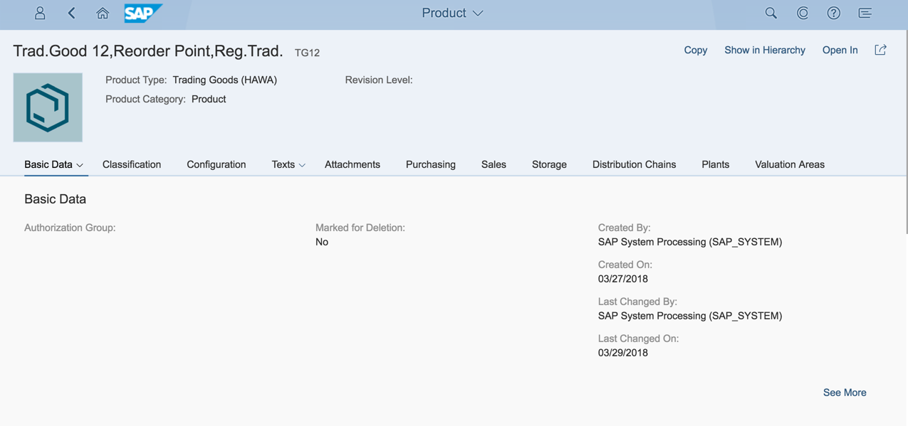

1. Open user settings via the corresponding application’s menu action
	
	  
	
1. Open the adaptation mode.

	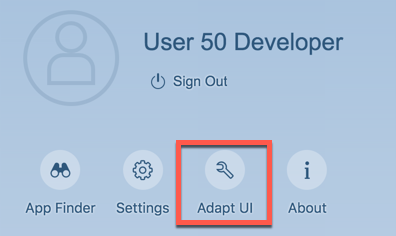

1. In the Product UI, hover over the **Basic Data** field area until it gets marked with another background color and the movements cursor appears. Then, right-click to open the context menu.
	
	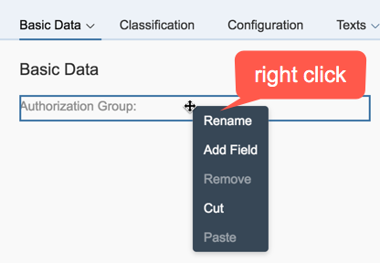  
	
1. In the context menu choose **Add Field**

	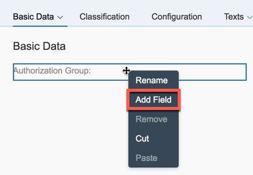

1. A list of all available but invisible fields opens. It contains standard as well as custom fields. Click the Create Custom Field action.
	
	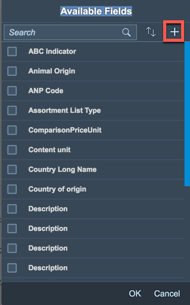  
  
1. A separate window with the Custom Fields and Logic application opens, which shows the list of custom fields and is automatically filtered for the Business Context of the Business UI that it was opened from.

1. Execute the Create Action.
	
	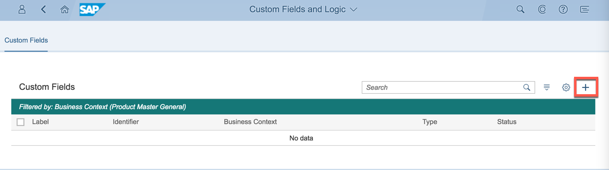  

1. In the opening popup maintain following data:

	| Field Name     | Field Value             | 
	| :------------- | :--------------------------- |
	| Label          | Bonus Percentage |
	| Type | Quantity with Unit    |
	
	Note: “Business Context” is prefilled as you came from an UI that belongs to it.

11. Execute **Create and Publish** Action.
	
	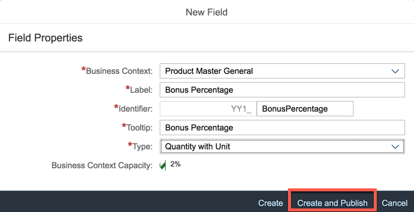  

1. The pop up closes and the list of customs fields is visible again. It contains an entry for the new field already and shows it in status **publishing…**. Publishing may take some time. Creates the persistence of the custom field and enables its usage on the UI that the creation was started from. 

1. Wait until the status switches to **Published** and close the application.

	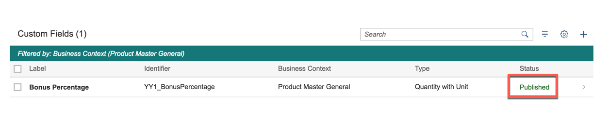

1. Refresh the Home page and open the adaptation mode.

	
	
1. Hover over the area below **Basic Data** area, then right click and select **Create Group** to trigger group creation.

	

1. A “New Group” Area appears to the right and name its title to “Bonus Data”.
	
	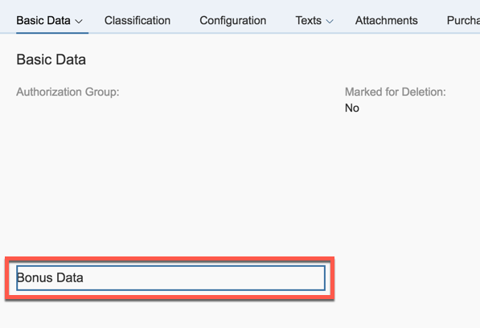  

1. Right click the “Bonus Data” area and click “Add Field”

	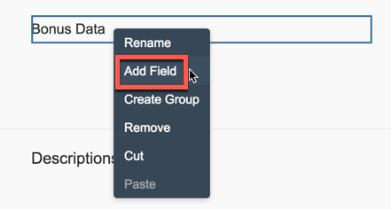

1. Choose the **Bonus Percentage** field from the list of available ones and click OK.
	
	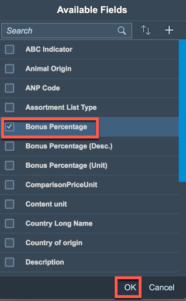  
	
1. Publish the UI changes.

	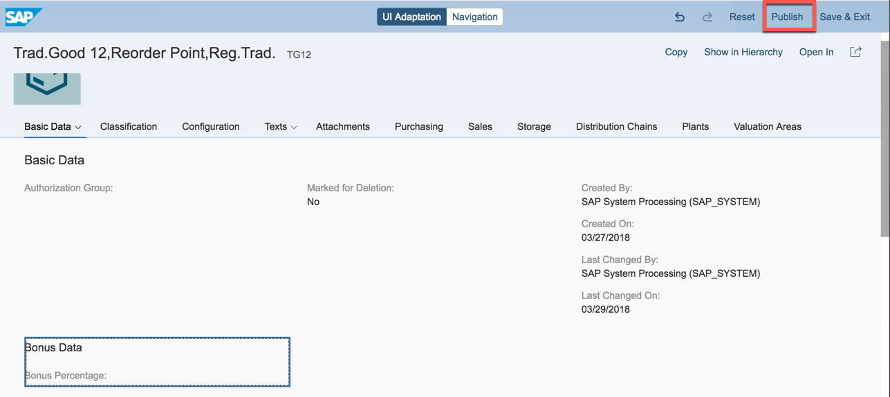

1. Save and Exit Adaptation Mode.
	
	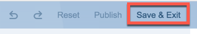  
	
###  Testing Custom Field Data

1. As still in the details of a product that shall become bonus relevant, start the Edit mode by executing the edit action
 
	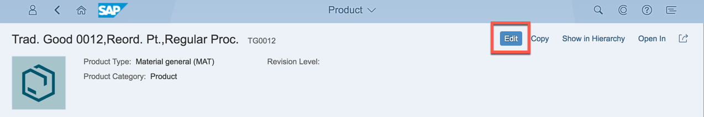

1. Enter following data in the Bonus Data group
	
	
	| Field Name     | Field Value             | 
	| :------------- | :--------------------------- |
	| Bonus Percentage  | 5 |
	| Bonus Percentage (Unit) | %    |
	

1. Save the product

	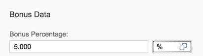 

####Method 2: Custom Field (Product) – via Extensibility Application

###  Creating and Enabling UI Usage of a Custom Field

1. Open the **Custom Fields and Logic** application

	

1. Execute the create action.
	
	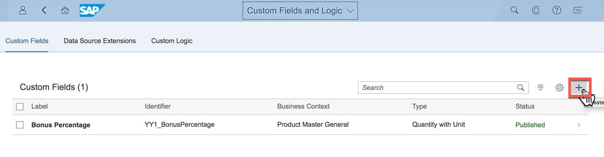  

1.  In the opening popup maintain following data:

	| Field Name     | Field Value             | 
	| :------------- | :--------------------------- |
	| Business Context          | Bonus Validity Period Start |
	| Label | Bonus Validity Period Start   |
	| Identifier | BonusValidityPerio    |
	| Type | Date    |

	Note: As the editable prefilled Identifier part (“BonusValidityPerio”) would not be understandable with regard to the Period End, change it to “BonusValidityStart”

1. Execute “Create and Edit” Action.
	
	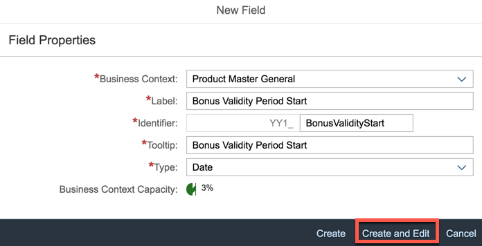  

1. Go to “UIs and Reports”
	
	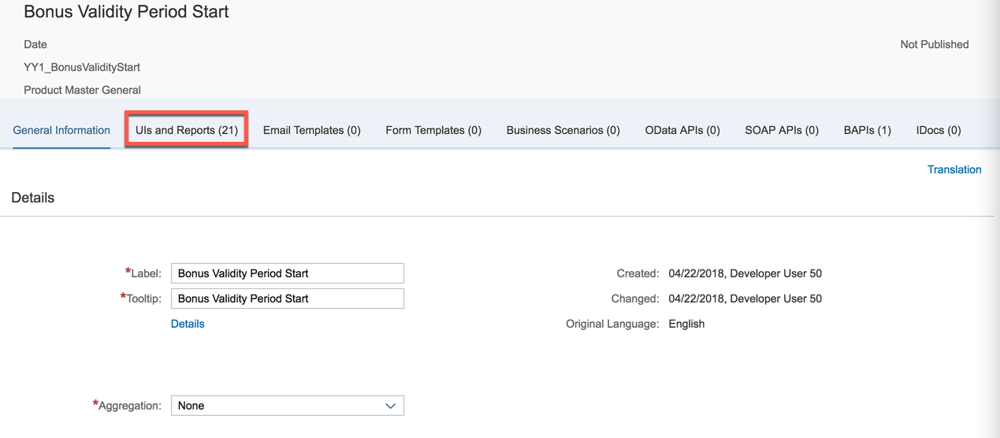  
	
1. “Enable Usage” for UI “Product Basic Data”. Save the change.
	
	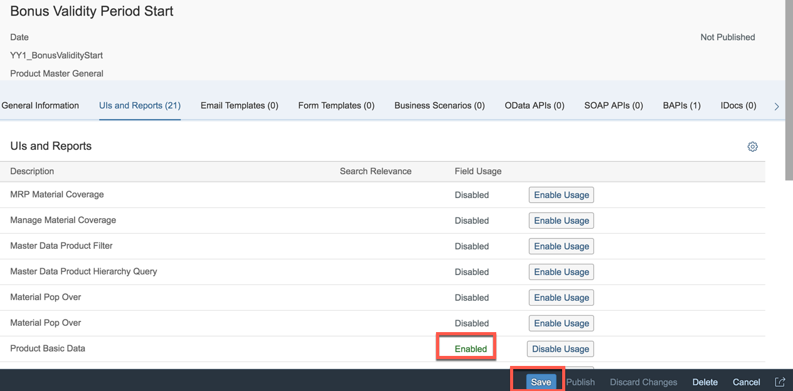  
	
1. Publish the field.
	
	 
	
1. This creates the persistence of the field and makes it available in adaptation mode of the chosen UI.

	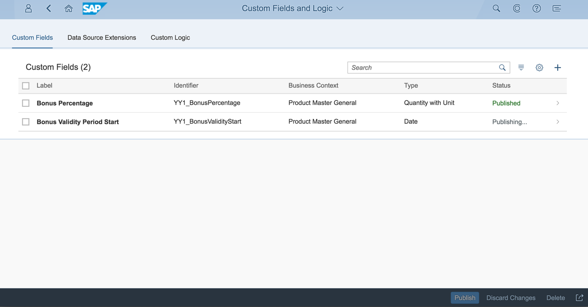  

###  Creating a Second Field

1. Repeat above steps for a second Custom Field “Bonus Validity Period End”.

	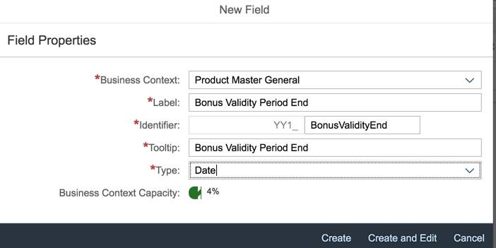
	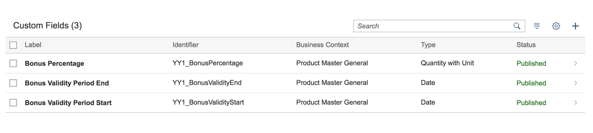

###  Adapting the UI

1. Open the **Manage Product Master Data** application

	

1. Execute **GO** action to get the list of products.
	
	
	

1. Enter Detail screen of a product that is used in a bonus relevant sales order.

	
	

1. Open user settings via the corresponding application’s menu action
	
	  
	
1. Open the adaptation mode.

	

1. Hover over “Bonus Data” area until it gets another background color, then right click and click “Add Field”
	
	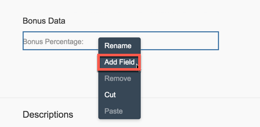  
	
1. In the opening list of available fields search for “Bonus Validity Period Start” and “Bonus Validity Period End”, mark both and execute the “OK” action.

	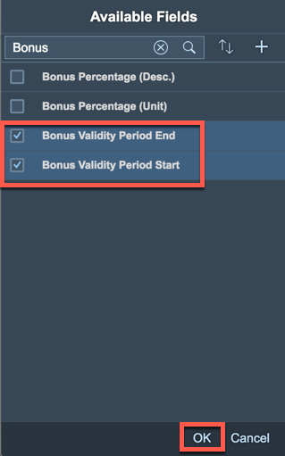

1. Publish the UI changes.
	
	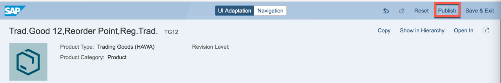 

1. Save and Exit Adaptation Mode.

	
	
###  Testing Custom Field Data

1. As still in the details of a product that shall become bonus relevant, start the Edit mode by executing the edit action
 
	

1. Enter following data in the Bonus Data group
	
	
	| Field Name     | Field Value             | 
	| :------------- | :--------------------------- |
	| Bonus Validity Period Start  | 01/01/1900 |
	| Bonus Validity Period End | 12/31/9999    |
	

1. Save the product

	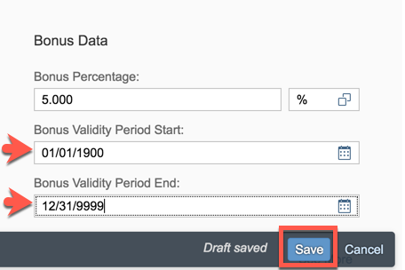 
 
	
## Summary
This concludes the exercise. 

You learn how to create Custom Fields at a standard business object and add them to its UI.
In the example a product manager wants to maintain a bonus percentage and validity period at the product to increase its sale.

Please proceed with next exercise.
