<table width=100% border=>
<tr><td colspan=2><h1>EXERCISE 1_8 - CREATE A SUB NODE</h1></td></tr>
<tr><td><h3>SAP Partner Workshop</h3></td><td><h1> &nbsp;15 min</h1></td></tr>
</table>


## Description
In this exercise, you’ll learn how 

* to deepen the structure of a custom business object by creating a sub node.

In the example a manager wants to define a list of bonus relevant products at the Bonus Plan.


For further reading on S/4HANA cloud in-app extension, click link below.
<https://jam4.sapjam.com/groups/m8lprEZwfU3zPoX0myj1Xu/overview_page/RfBJ6ix9q00bbSseaxm4zW>


## Target group

* Developers
* People interested in learning about S/4HANA Cloud extension and SDK  


## Goal

So far, we have created two applications. One to maintain employee specific Bonus Plans and a second to entitle bonuses for an employee. Until now the Bonus is only dependent on the net amount of completed sales orders.

**Task:** Reference standard business objects at custom business objects.

**Example:** At the Bonus Plan there shall be maintained products which are bonus relevant.


## Prerequisites
  
Below are the prerequisites for this exercise.

* Google Chrome: Please complete this exercise using the Google Chrome browser
* **Authorizations:** Your user needs a business role with business catalog **Extensibility** (ID: `SAP_CORE_BC_EXT`)


## Steps

1. [Enhancing Bonus Plan’s structure](#enhancing-bonus-plan-structure)
1. [Enhancing Bonus Plan’s logic](#enhancing-bonus-plan-logic)
1. [Testing and Creating Bonus Plan](#testing-and-creating-bonus-plan)

### <a name="enhancing-bonus-plan-structure"></a> Enhancing Bonus Plan’s structure

1. **Start** the Custom Business Object's application by clicking its tile 

	 
	
1. **Search** for the "Bonus PlanXX" object and open its details by clicking its list item. Note: XX is the number assigned to you.

  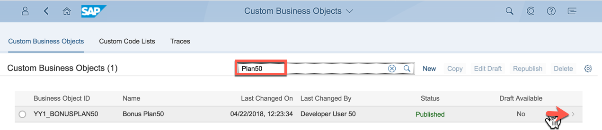 
  
1. Create a draft version to be able to do changes by executing “Edit Draft” action.

	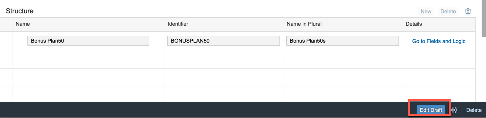 
	
1. Create a new sub node by clicking the “New” action at the structure list

	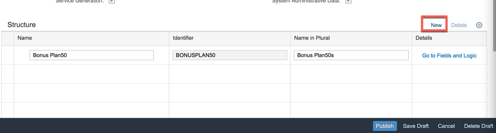 

1. Name the sub node “Relevant ProductXX”. Note: XX is the number assinged to you. Go to Fields and Logic of this new node.

	 

1. Create following fields. Note: XX is the number assigned to you.

	| Field Name     | Field Properties             | Tooltip     |
	| :------------- | :--------------------------- | :-----------|
	| ProductXX ID     | Text of length 20||   
	| ProductXX Description | Text of length 255, read only    | |


1. The UI for maintaining fields looks as follows. 

	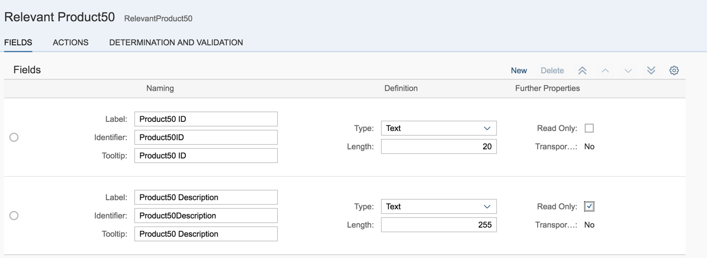 
	
1. Go back via the application's **Back** button. 

	 
	
1. Publish. This will enhance the persistence of bonus plans and their UI by a list of product IDs and description.

	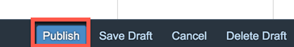 

### <a name="enhancing-bonus-plan-logic"></a> Enhancing Bonus Plan’s logic

1. To fill the description of relevant products, do following:

1. Go to **Fields and Logic** of the **Relevant ProductX** sub node

	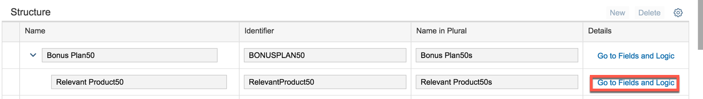

1. Enter the **After Modification** Event Logic

	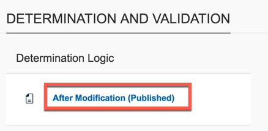 

1. Implement following functionality:

	Fill the product description

	>**Hint:** Use CDS view I_ProductDescription and filter with the current productid and language english.

	```abap
	SELECT
	   i_productdescription~productdescription
	 FROM
	  i_productdescription
	 INTO @relevantproductXX-productXXdescription
	 WHERE i_productdescription~product = @relevantproductXX-productXXid
	  AND i_productdescription~language = 'E'.
	 ENDSELECT.
	```

1. **Publish** the logic.

	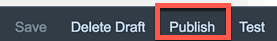 

### <a name="testing-and-creating-bonus-plan"></a> Testing and Creating Bonus Plan

1. Open the **Bonus PlanXX** application

	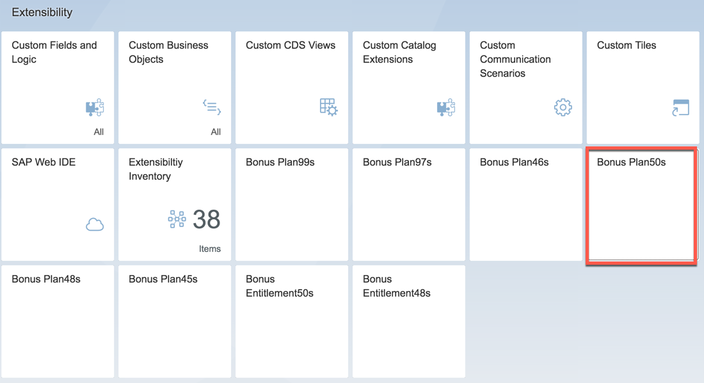 

1. Create a **new** Bonus Plan.

	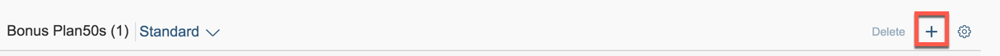 

1. Enter following **General Information** > “General Information” data


	| Field     | Value             | Note    |
	| :------------- | :--------------------------- | :-----------|
	| Release Status     | 2||   


1. Enter following **General Information** > “Bonus Data” data

	| Field     | Value             | Note    |
	| :------------- | :--------------------------- | :-----------|
	| Validity Start Date     | 01/01/2018||   
	| Validity End Date    | 12/31/2018|| 
	| Target Amount    | 1000.00 EUR||  
	| Low Bonus Assignment Factor   | 1||  
	| High Bonus Assignment Factor    | 3||  	| Low Bonus Percentage     | 10|| 	| High Bonus Percentage     | 20|| 
	| Employee ID    | any||  
	
	`employeeid` `<any>` shall be the one of a sales person that created sales orders with a Net Amount of more than 3000.00 EUR in 2018 and that are completed. In this exercise, you can use CB9980000008.

1. **Save**.

	 
	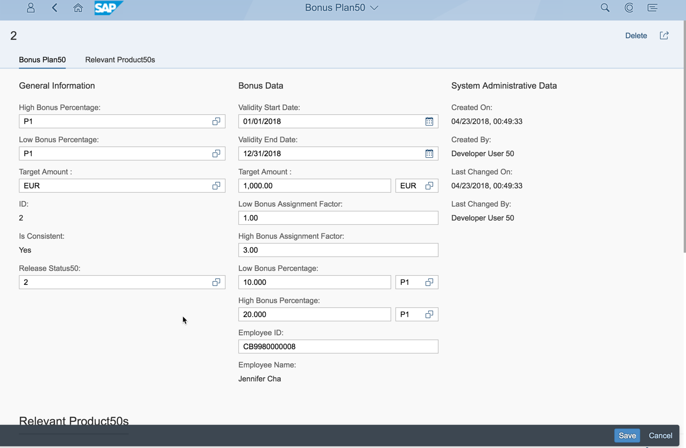 

1. Get back to the detail of the newly created bonus plan. The new sub node **Relevant ProductXX** of the custom business object leads to a new UI section with a table. Go to this section and execute the **Add** action. 

	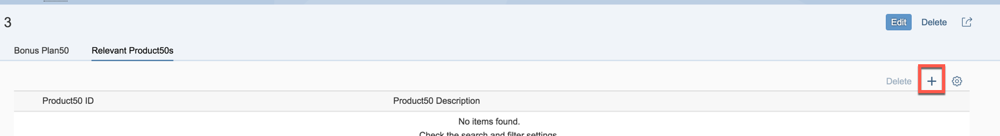 

1. Enter your product master ID, for example: TG12 for "Trad.Good 12,Reorder Point,Reg.Trad".

	 
	
1. **Save** the Bonus Plan.

	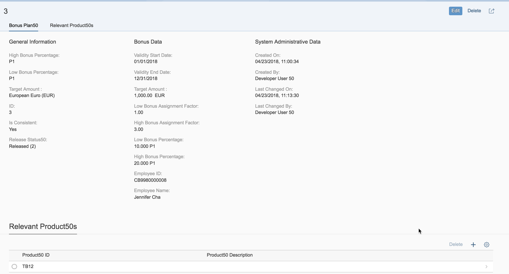

## Summary
This concludes the exercise. 

You should have learned to deepen the structure of a custom business object by creating a sub node.

Please proceed with next exercise.
