<table width=100% border=>
<tr><td colspan=2><h1>EXERCISE 1_9 - USE CUSTOM FIELDS TO READ DATA - READ ONLY</h1></td></tr>
<tr><td><h3>SAP Partner Workshop</h3></td><td><h1> &nbsp;30 min</h1></td></tr>
</table>


## Description
In this exercise, you’ll learn how 

* to use custom fields by reading their data.
In the example the Bonus Entitlement is enhanced by calculating an additional bonus for relevant sold products (percentage of the sales volume for them)

For further reading on S/4HANA cloud in-app extension, click link below.
<https://jam4.sapjam.com/groups/m8lprEZwfU3zPoX0myj1Xu/overview_page/RfBJ6ix9q00bbSseaxm4zW>


## Target group

* Developers
* People interested in learning about S/4HANA Cloud extension and SDK  


## Goal

So far, we have created two applications. One to maintain employee specific Bonus Plans and a second to entitle bonuses for an employee. Until now the Bonus Entitlement is only dependent on the net amount of completed sales orders, but at the Bonus Plan one can already maintain relevant products.

**Task:** Make use of custom fields.

**Example:** Custom Fields for Bonus Data at Product are used to calculate an additional product based bonus.

## Prerequisites
  
Below are the prerequisites for this exercise.

* Google Chrome: Please complete this exercise using the Google Chrome browser
* **Authorizations:** Your user needs a business role with business catalog **Extensibility** (ID: `SAP_CORE_BC_EXT`)
* Having Sales Orders in the system for the employee of the bonus plan as creator. The sales Orders where created within the validity period of the bonus plan. Their sum of Net Amount is higher than 3000,- Euros (multiplication product of bonus plan’s Target Amount and High Bonus Assignment Factor) and consist of at least one product that is bonus relevant for the employee.
* To be able to create Sales Order a user needs Business Catalog `SAP_SD_BC_SO_PROC_MC`.
* To be able to complete Sales Orders a user needs Business Catalog `SAP_LE_BC_ODLV_PROC_MC`

## Steps

1. [Enabling Custom Fields readability](#enabling-custom-fields-readability)
1. [Enhancing Bonus Entitlement’s structure](#enhancing-bonus-entitlement-structure)
1. [Enhancing Bonus Entitlement’s logic](#enhancing-bonus-entitlement-logic)
1. [Testing and Creating Bonus Entitlement](#testing-and-creating-bonus-entitlement)

### <a name="enabling-custom-fields-readability"></a> Enabling Custom Fields readability


The enablement of the Bonus fields in the Product UI, doesn’t offer a possibility to read their data in Custom Business objects yet. To achieve that, do the following

1. **Start** the **Custom Fields and Logic** application by clicking its tile 

	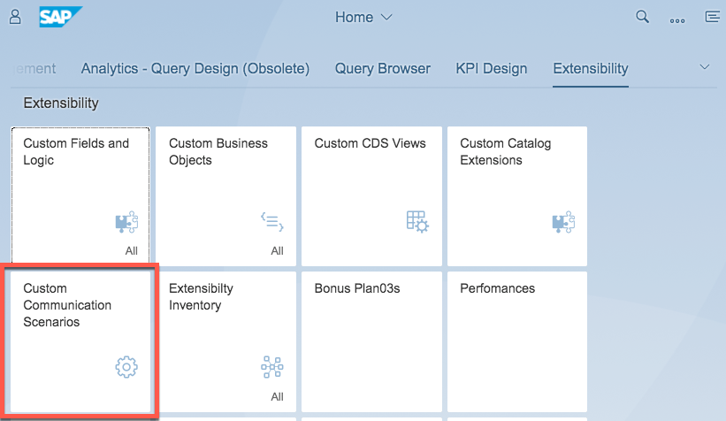 
	
1. Search for the Bonus Fields and do the following 3 steps for each of them.

  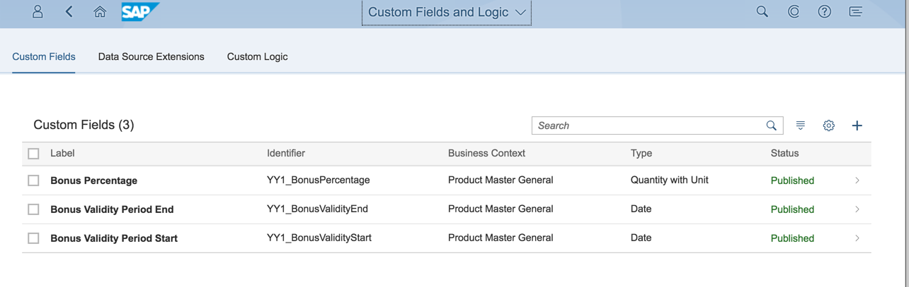 
  
1. Open the details by clicking the field’s list item

	
1. Go to **UIs and Reports**

	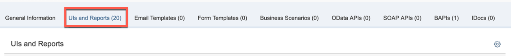 

1. **Enable Usage** for **Product active core entity**

	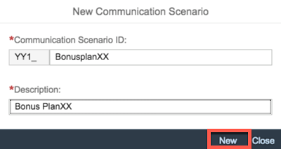 

1. **Save** the change.

1. **Publish** the field.

	 
	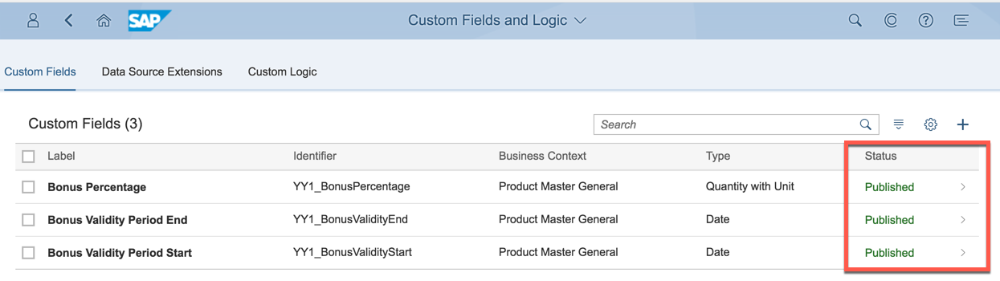 

	This has enhanced a CDS View with the field.

	>**Hint:** To see the CDS View name, open table Personalization via the action in the upper right corner

	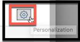 
	
	**Check** the **Data Source** Column and press **OK** to make that column visible in the table.
	
	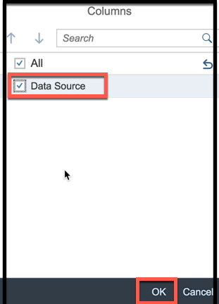
	
	Now you can see the CDS View’s name **i_product** that you have to use to get the custom field data in logic implementations
	
	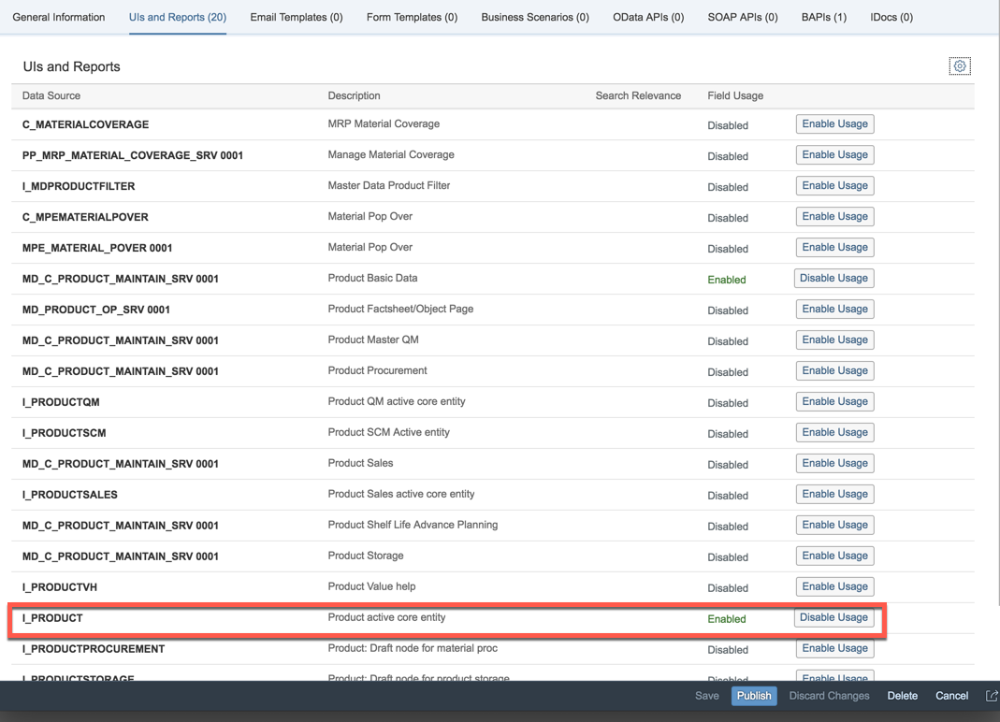 

### <a name="enhancing-bonus-entitlement-structure"></a> Enhancing Bonus Entitlement’s structure

All relevant products maintained at a bonus plan shall be considered at bonus calculation.

1. Start the **Custom Business Object**’s application by clicking its tile	

	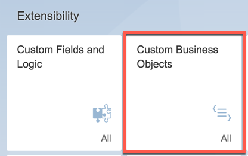

1. **Search** for the **Bonus EntitlementXX** object and open its details by clicking its list item

	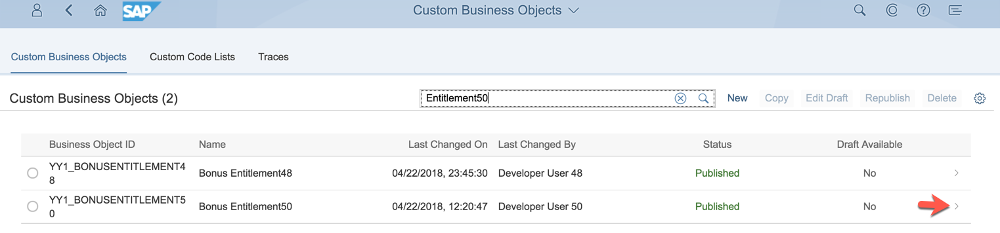

1. Create a draft version to be able to do changes by executing **Edit Draft** action.

	

1. **Go to Fields and Logic** of the its one node.

	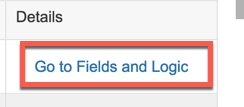

1. Create following field. Note: XX is the number assigned to you.

	| Field Name     | Field Properties             | Tooltip     |
	| :------------- | :--------------------------- | :-----------|
	| Product BonusXX Amount     | Amount with Currency ||   
	
	
	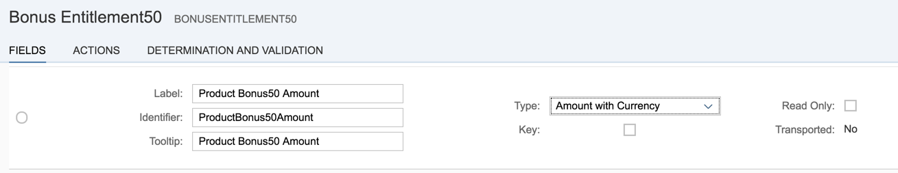

1. Go **Back** and **Publish**.

	
	
	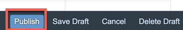
	
	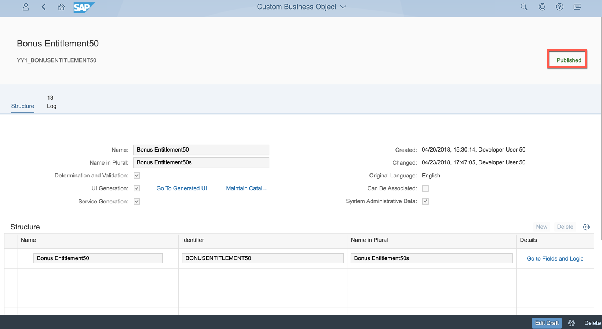

### <a name="enhancing-bonus-entitlement-logic"></a> Enhancing Bonus Entitlement’s logic

1. **Go to Fields and Logic** of Bonus EntitlementXX.

	

1. Enter the **After Modification** Event Logic

	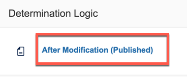

1. Implement following additional functionality:

####Bonus Calculation:

1. Get the relevant products from the bonus plan

	>**Hint:** The CDS view name for that sub node is YY1_RELEVANTPRODUCTXX_BONUSPLA and can be seen in Custom Business Object’s structure table by making the Data Source column visible.
	
	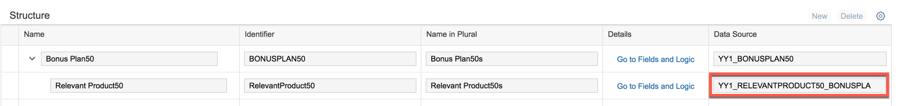 

	>**Hint:** The association between parental bonus plan and sub node data for relevant products is ensured by technical key fields. Every node has a field named sap_uuid, every sub node additionally has a sap_parental_uuid.

1. For each product, check if it has a bonus percentage, if yes get the employee’s actual revenue from the completed Sales Orders that fulfill following conditions:
	- created by the bonus plan’s employee
	- in overall status “Completed”
	- created in the validity period of the bonus plan
	- created in the bonus validity period of the product
	- with the current product (precondition is, that a sales order has only items of one and the same product)
	
	>**Hint:** You can read custom field data at the product via CDS View “i_product”

	>**Hint:** There is the CDS view I_SalesOrderItemCube with the parameters Exchange Rate (take ‘M’) and Display Currency (should be the one from bonus plan’s target amount). This view offers the netamountindisplaycurrency which does already currency conversion


	>**Hint:** You need following view field to restrict the results correctly:

	- “createdbyuser”
	- “overallsdprocessstatus” (value “C” stands for completed)
	- “creationdate”
	- “material”

1. If the net amount is greater than 0, calculate the product specific bonus

1. Sum the product specific bonus to the bonuses of other products


1. Add the product bonus amount to the total bonus amount


1. Write a listing of products into the bonus entitlement’s description


	```abap
	" calculate product bonus
	        DATA: relevantproductsXX TYPE TABLE OF yy1_relevantproductXX_bonuspla.
	        DATA: products_s TYPE string.
	        DATA: productbonusXX TYPE i.
	        DATA: products TYPE TABLE OF i_product.
	        DATA: product LIKE LINE OF products.
	
	        SELECT *
	         FROM yy1_relevantproductXX_bonuspla
	         INTO TABLE @relevantproductsXX
	         WHERE sap_parent_uuid EQ @bonusplanXX-sap_uuid.
	
	        LOOP AT relevantproductsXX INTO DATA(relevant_product).
	        " get net amount for product
	            SELECT *
	             FROM i_product
	             INTO @product
	             WHERE i_product~product = @relevant_product-productXXid.
	            ENDSELECT.
	            
	            CONCATENATE products_s product-product INTO products_s SEPARATED BY ','.
	
	            IF product-yy1_bonuspercentage_prd GT 0.
	                SELECT FROM i_salesorderitemcube( p_exchangeratetype = 'M', p_displaycurrency = @bonusplanXX-targetamount_c )
	                 FIELDS SUM( netamountindisplaycurrency )
	                 WHERE createdbyuser = @bonusplanXX-employeeid
	                  AND overallsdprocessstatus = 'C'
	                  AND creationdate BETWEEN @bonusplanXX-validitystartdate AND @bonusplanXX-validityenddate
	                  AND creationdate BETWEEN @product-yy1_bonusvaliditystart_prd AND @product-yy1_bonusvalidityend_prd
	                  AND material = @relevant_product-productXXid
	                 INTO @bonusentitlementXX-productbonusXXamount_v.
	
	        " if net amount for product greater 0, calculate its bonus
	                IF bonusentitlementXX-productbonusXXamount_v GT 0.
	                   bonusentitlementXX-productbonusXXamount_v = bonusentitlementXX-productbonusXXamount_v * product-yy1_bonuspercentage_prd / 100.
	                   productbonusXX = productbonusXX + bonusentitlementXX-productbonusXXamount_v.
	                ENDIF.
	            ENDIF.
	
	        ENDLOOP.
	
	        bonusentitlementXX-productbonusXXamount_v = productbonusXX.
	        bonusentitlementXX-productbonusXXamount_c = bonusplanXX-targetamount_c.
	
	" calculate total bonus
	        bonusentitlementXX-totalbonusamount_v = bonusentitlementXX-lowbonusamount_v + bonusentitlementXX-highbonusamount_v + bonusentitlementXX-productbonusXXamount_v.
	        bonusentitlementXX-totalbonusamount_c = bonusplanXX-targetamount_c.
	
	" write bonus plan information into description
	        DATA(employee_s) = CONV string( bonusplanXX-employeename ).
	"        DATA(target_s) = CONV string( bonusplanXX-targetamount_v ).
	"        DATA(lowf_s) = CONV string( bonusplanXX-lowbonusassignmentfactor ).
	"        DATA(lowp_s) = CONV string( bonusplanXX-lowbonuspercentage_v ).
	"        DATA(highf_s) = CONV string( bonusplanXX-highbonusassignmentfactor ).
	"        DATA(highp_s) = CONV string( bonusplanXX-highbonuspercentage_v ).
	        CONCATENATE 'Bonus Run for Plan: ' bonusentitlementXX-bonusplanXXid
	                    ' of Employee: ' employee_s
	                    ' with Target Amount: ' target_s
	                    ', Low Factor: ' lowf_s
	                    ', Low Percentage: ' lowp_s
	                    ', High Factor: ' highf_s
	                    ', High Percentage: ' highp_s
	                    ', Products: ' products_s INTO bonusentitlementXX-description SEPARATED BY space.
	```

1. **Publish** the logic.


### <a name="testing-and-creating-bonus-entitlement"></a> Testing and Creating Bonus Entitlement

1. Open the **Bonus EntitlementXX** application.

1. Create an object.

	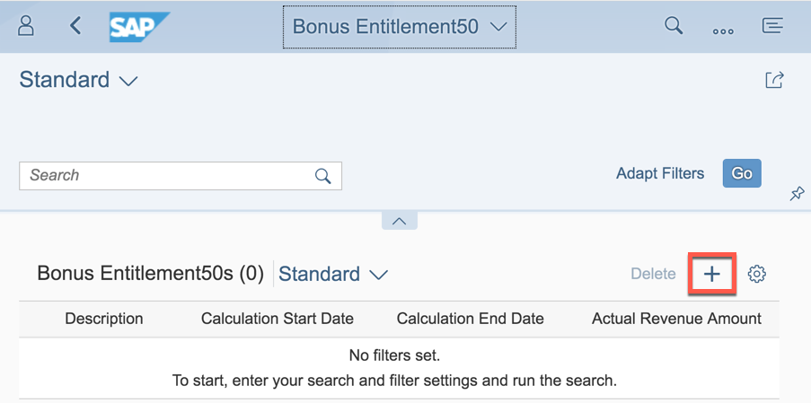 

1. Enter following data


	| Field     | Value             | Note    |
	| :------------- | :--------------------------- | :-----------|
	| Bonus PlanXX     | 2||   
 

1. **Save** the Bonus EntitlementXX. All Data of the Entitlement will get filled, including the product based bonus.

	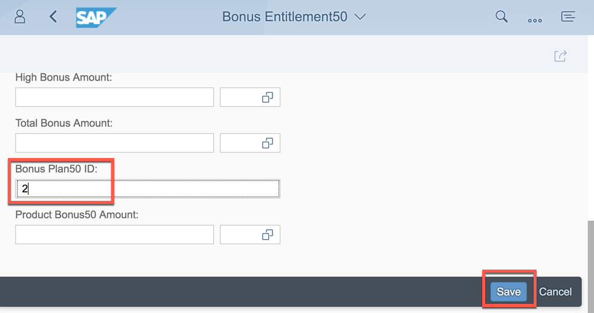
	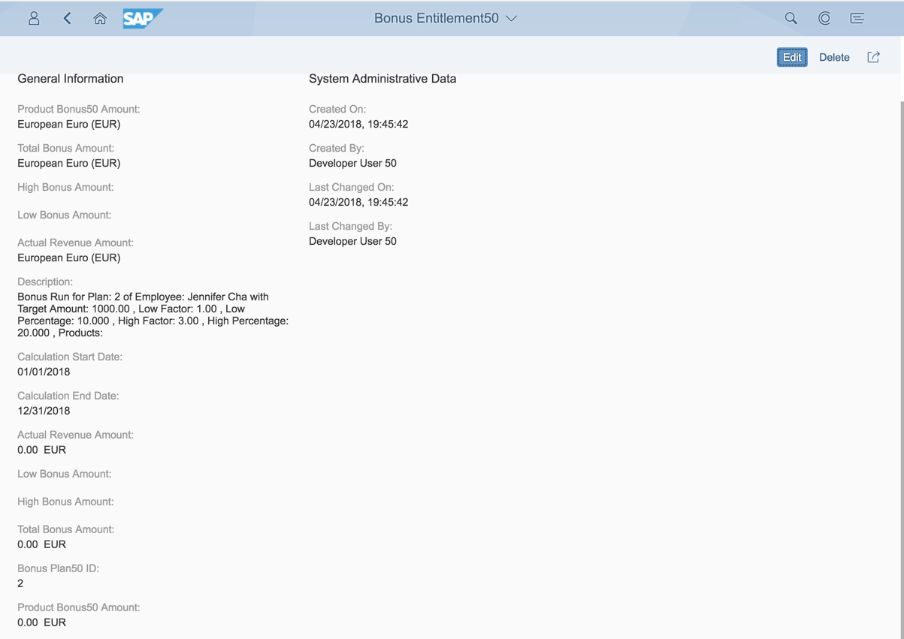


## Summary
This concludes the exercise. 

You should have learned to use custom fields by reading their data.
In the example the Bonus Entitlement is enhanced by calculating an additional bonus for relevant sold products (percentage of the sales volume for them).

Please proceed with next exercise.
