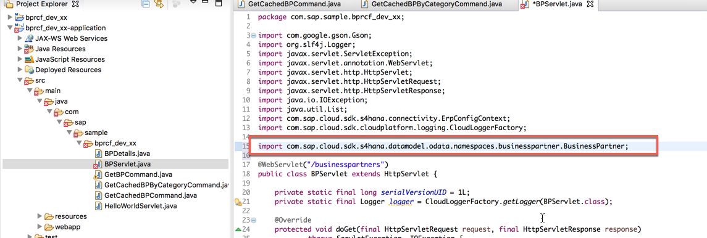
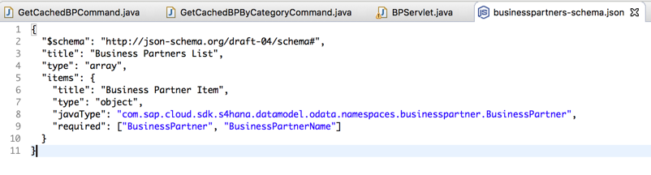
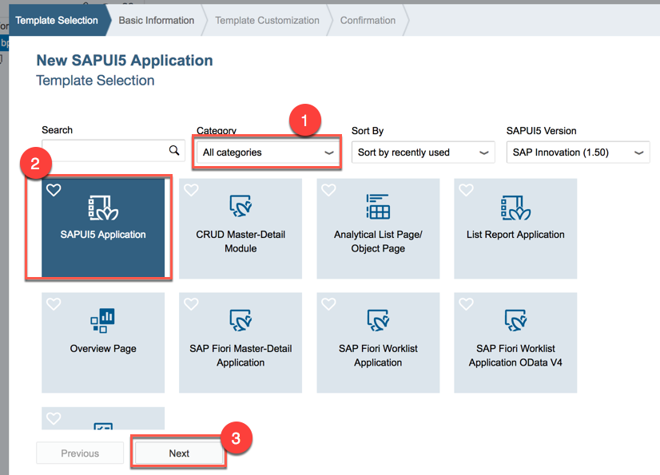
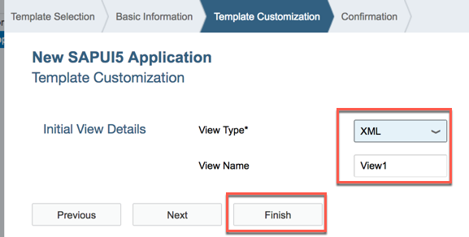
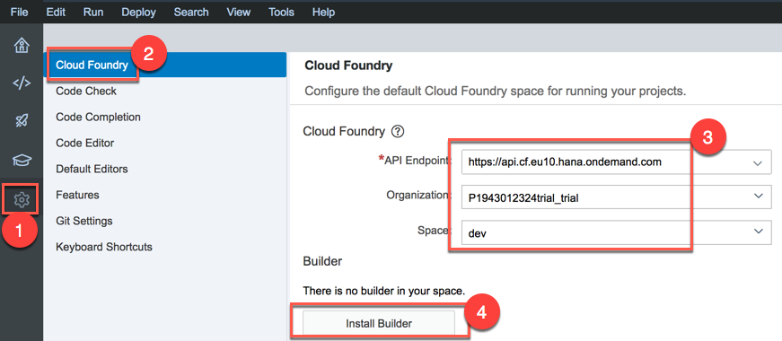
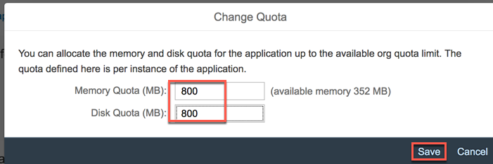
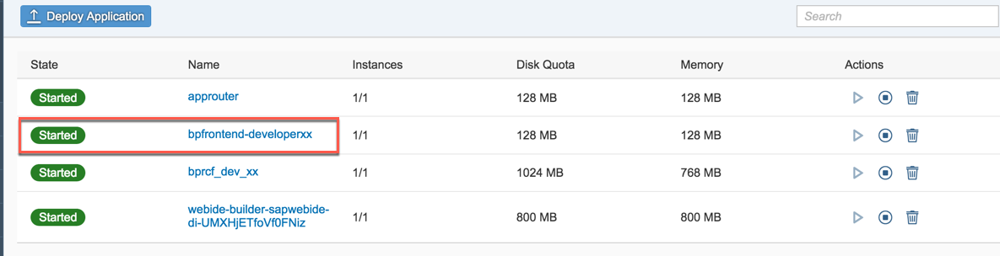

<table width=100% border=>
<tr><td colspan=2><h1>EXERCISE 08 - DEVELOP A FRONT-END APPLICATION USING VIRTUAL DATA MODEL(VDM)</h1></td></tr>
<tr><td><h3>SAP Partner Workshop</h3></td><td><h1> &nbsp;60 min</h1></td></tr>
</table>


## Description
In this exercise, you’ll learn how to 

* introduce Virtual Data Model (VDM) into your application
* create a frontend application with SAP Web IDE Full-Stack.

The data stored in an S/4HANA system is inherently complexly structured and therefore difficult to query manually. For this reason, HANA introduced a Virtual Data Model (VDM) that aims to abstract from this complexity and provide data in a semantically meaningful and easy to consume way. The preferred way to consume data from an S/4HANA system is via the OData protocol. While BAPIs are also supported for compatibility reasons, OData should always be your first choice. You can find a list of all the available OData endpoints for S/4HANA Cloud systems in [SAP’s API Business Hub](https://api.sap.com/shell/discover/contentpackage/SAPS4HANACloud?section=ARTIFACTS).

The S/4HANA Cloud SDK now brings the VDM for OData to the Java world to make the type-safe consumption of OData endpoints even more simple! The VDM is generated using the information from SAP’s API Business Hub. This means that it’s compatible with every API offered in the API Business Hub and therefore also compatible with every S/4HANA Cloud system.

Looking at the code you wrote previously

```java
final List<BPDetails> businessPartners =
    ODataQueryBuilder
        .withEntity("/sap/opu/odata/sap/API_BUSINESS_PARTNER", "A_BusinessPartner")
        .select("BusinessPartner", "BusinessPartnerName", "BusinessPartnerCategory", "BusinessPartnerGrouping", "LastName","FirstName")
        .top(100)
        .build()
        .execute(getConfigContext())
        .asList(BPDetails.class);
```

you can see that, in order to retrieve Business Partners, you already had to know three things:

- the OData endpoints service path (`/sap/opu/odata/sap`)
- the endpoints name (`API\_BUSINESS_PARTNER`)
- the name of the entity collection (`A_BusinessPartner`) as defined in the endpoints metadata.

Then, when you want to select specific attributes from the BusinessPartner entity with the select() function, you need to know how these fields are called. But since they are only represented as strings in this code, you need to look at the metadata to find out how they’re called. The same also applies for functions like order() and filter(). And of course using strings as parameters is prone to spelling errors that your IDE most likely won’t be able to catch for you.

Finally, you need to define a class such as `BPDetails` with specific annotations that represents the properties and their types of the result. For this you again need to know a lot of details about the OData service.

Now, with VDM, it's all much easier!
Using VDM you now have access to an object representation of a specific OData service, in this case the `BusinessPartnerService`. So now there’s no more need to know the endpoint’s service path, service name or entity collection name. We can call this service’s `getAllBusinessPartner()` function to retrieve a list of all the business partners from the system.

Now take a look at the select() function. Instead of passing strings that represent the field of the entity, we can simply use the static fields provided by the BusinessPartner class. So not only have we eliminated the risk of spelling errors, we also made it type-safe! Again, the same applies for filter() and orderBy(). For example, filtering to a specific business partner category becomes as easy as `.filter(BusinessPartner.BUSINESS_PARTNER_CATEGORY.eq(bpCategory))`.

An additional benefit of this approach is discoverability. Since everything is represented as code, you can simply use your IDE’s autocompletion features to see which functions a service supports and which fields an entity consists of: start by looking at the different services that are available in the package `com.sap.cloud.sdk.s4hana.datamodel.odata.services`, select the service you need, and then look for the static methods of the service class that represent the different available operations. Based on this, you can choose the fields to select and filters to apply using the fields of the return type.

To sum up the advantages of the OData VDM:

- No more hardcoded strings
- No more spelling errors
- Type safety for functions like filter, select and orderBy
- Java data types for the result provided out of the box, including appropriate conversions
- Discoverability by autocompletion
- Currently the VDM supports retrieving entities by key and retrieving lists of entites along with filter(), select(), orderBy(), top() and skip(). You can also resolve navigation properties on demand and use function imports. Future releases will bring even more enhancements to its functionality.

For further reading on SAP S/4HANA Cloud SDK, click link below.
<https://www.sap.com/germany/developer/topics/s4hana-cloud-sdk.html>


## Target group

* Developers
* People interested in learning about S/4HANA extension and SDK  


## Goal

The goal of this exercise is to create a frontend application for your service which uses Virtual Data Model(VDM).  

## Prerequisites
  
Here below are prerequisites for this exercise.

* A trial account on the SAP Cloud Platform. You can get one by registering [here](https://account.hanatrial.ondemand.com)
* Apache Maven 3.3.9+ [download it here](https://maven.apache.org/download.cgi)
* Java JDK 8
* Cloud Foundry CLI [download it here](https://github.com/cloudfoundry/cli)
* The source code created in the previous exercise
* A S/4HANA system with a working communication arrangement for the Business Partners collection


## Steps

1. [Implement VDM](#implement-vdm)
1. [Build frontend application with SAP Web IDE](#frontend-application)


### <a name="implement-vdm"></a>Implement VDM
In this chapter you are going to see how to implement Virtual Data Model in your application. Specifically, you are going to change the two latest classes introduced after implementing caching and resilience, **GetCachedBPCommand** and **GetCachedBPByCategoryCommand**.

1. Let's start with **GetCachedBPCommand**. Open this class and add a couple of new imports to the class

	```java
	import com.sap.cloud.sdk.s4hana.datamodel.odata.namespaces.businesspartner.BusinessPartner;
	import com.sap.cloud.sdk.s4hana.datamodel.odata.services.DefaultBusinessPartnerService;
	```

	
1. Replace the line

	```java
	final List<BPDetails> businessPartners =
	    ODataQueryBuilder
	        .withEntity("/sap/opu/odata/sap/API_BUSINESS_PARTNER", "A_BusinessPartner")
	        .select("BusinessPartner", "BusinessPartnerName", "BusinessPartnerCategory", "BusinessPartnerGrouping", "LastName","FirstName")
	        .top(100)
	        .build()
	        .execute(getConfigContext())
	        .asList(BPDetails.class);
	```
with the following

	```java
	final  List<BusinessPartner> businessPartners = new DefaultBusinessPartnerService().getAllBusinessPartner()
	        .select(BusinessPartner.BUSINESS_PARTNER,
	                BusinessPartner.BUSINESS_PARTNER_NAME,
	                BusinessPartner.BUSINESS_PARTNER_CATEGORY,
	                BusinessPartner.BUSINESS_PARTNER_GROUPING,
	                BusinessPartner.LAST_NAME,
	                BusinessPartner.FIRST_NAME)
	        .top(100)
	        .execute(getConfigContext());
	```
  
	
1. Of course, doing this you introduced some errors in the code. No worries!. You just need to replace all the **BPDetails** references (5 matches) with **BusinessPartner**, because now we are no longer using the BPDetails class we have defined, but the predefined one coming from the VDM. Go to the **Edit->Find/Replace** menu, enter "BPDetails" in the find box and "BusinessPartner" in the replace box and click **Replace all**. You should have just 5 matches   
	
1. Feel free to remove the **OdataQueryBuilder** import from the class because it's no longer needed   
	
1. This is the final code for this class (remember that **xx** must be replaced with your workstation ID)

	```java
	package com.sap.sample.bprcf_dev_xx;
	
	import java.util.Collections;
	import java.util.List;
	
	import com.google.common.cache.Cache;
	import com.google.common.cache.CacheBuilder;
	
	import com.sap.cloud.sdk.cloudplatform.cache.CacheKey;
	import com.sap.cloud.sdk.odatav2.connectivity.ODataException;
	import com.sap.cloud.sdk.odatav2.connectivity.ODataExceptionType;
	import com.sap.cloud.sdk.s4hana.connectivity.CachingErpCommand;
	import com.sap.cloud.sdk.s4hana.connectivity.ErpConfigContext;
	
	import lombok.NonNull;
	
	import com.sap.cloud.sdk.s4hana.datamodel.odata.namespaces.businesspartner.BusinessPartner;
	import com.sap.cloud.sdk.s4hana.datamodel.odata.services.DefaultBusinessPartnerService;
	
	public class GetCachedBPCommand extends CachingErpCommand<List<BusinessPartner>>
	{
	    private static final Cache<CacheKey, List<BusinessPartner>> cache =
	            CacheBuilder.newBuilder().build();
	
	    public GetCachedBPCommand( @NonNull final ErpConfigContext configContext )
	    {
	        super(GetCachedBPCommand.class, configContext);
	    }
	
	    @Override
	    protected Cache<CacheKey, List<BusinessPartner>> getCache()
	    {
	        return cache;
	    }
	
	    @Override
	    protected List<BusinessPartner> runCacheable() throws ODataException {
	        try {
	        	final  List<BusinessPartner> businessPartners = new DefaultBusinessPartnerService().getAllBusinessPartner()
	        	        .select(BusinessPartner.BUSINESS_PARTNER,
	        	                BusinessPartner.BUSINESS_PARTNER_NAME,
	        	                BusinessPartner.BUSINESS_PARTNER_CATEGORY,
	        	                BusinessPartner.BUSINESS_PARTNER_GROUPING,
	        	                BusinessPartner.LAST_NAME,
	        	                BusinessPartner.FIRST_NAME)
	        	        .top(100)
	        	        .execute(getConfigContext());
	            return businessPartners;
	        }
	        catch( final Exception e) {
	            throw new ODataException(ODataExceptionType.OTHER, "Failed to get Business Partners from OData command.", e);
	        }
	    }
	
	    @Override
	    protected List<BusinessPartner> getFallback() {
	        return Collections.emptyList();
	    }
	}
	```  
	
1. The same changes must be done to the second class **GetCachedBPByCategoryCommand**. The only difference here is that here we need also to introduce a line for filtering all the Business Partners by the passed category `.filter(BusinessPartner.BUSINESS_PARTNER_CATEGORY.eq(bpCategory))`. This is the final code (remember that **xx** must be replaced with your workstation ID)

	```java
	package com.sap.sample.bprcf_dev_xx;
	
	import java.util.Collections;
	import java.util.List;
	import java.util.concurrent.TimeUnit;
	import com.google.common.cache.Cache;
	import com.google.common.cache.CacheBuilder;
	import com.sap.cloud.sdk.cloudplatform.cache.CacheKey;
	import com.sap.cloud.sdk.odatav2.connectivity.ODataException;
	import com.sap.cloud.sdk.odatav2.connectivity.ODataExceptionType;
	import com.sap.cloud.sdk.s4hana.connectivity.CachingErpCommand;
	import com.sap.cloud.sdk.s4hana.connectivity.ErpConfigContext;
	import com.sap.cloud.sdk.s4hana.datamodel.odata.namespaces.businesspartner.BusinessPartner;
	import com.sap.cloud.sdk.s4hana.datamodel.odata.services.DefaultBusinessPartnerService;
	
	import lombok.NonNull;
	
	public class GetCachedBPByCategoryCommand extends CachingErpCommand<List<BusinessPartner>>
	{
	    @NonNull
	    private final String bpCategory;
	    public GetCachedBPByCategoryCommand (
	            @NonNull final ErpConfigContext configContext,
	            @NonNull final String bpCategory )
	    {
	        super(GetCachedBPByCategoryCommand.class, configContext);
	        this.bpCategory = bpCategory;
	    }
	
	    private static final Cache<CacheKey, List<BusinessPartner>> cache =
	            CacheBuilder.newBuilder()
	                    .maximumSize(100)
	                    .expireAfterAccess(60, TimeUnit.SECONDS)
	                    .concurrencyLevel(10)
	                    .build();
	
	    @Override
	    protected Cache<CacheKey, List<BusinessPartner>> getCache()
	    {
	        return cache;
	    }
	
	    @Override
	    protected CacheKey getCommandCacheKey()
	    {
	        return super.getCommandCacheKey().append(bpCategory);
	    }
	
	    @Override
	    protected List<BusinessPartner> runCacheable() throws ODataException {
	        try {
	        	final  List<BusinessPartner> businessPartners = new DefaultBusinessPartnerService().getAllBusinessPartner()
	        	        .select(BusinessPartner.BUSINESS_PARTNER,
	        	                BusinessPartner.BUSINESS_PARTNER_NAME,
	        	                BusinessPartner.BUSINESS_PARTNER_CATEGORY,
	        	                BusinessPartner.BUSINESS_PARTNER_GROUPING,
	        	                BusinessPartner.LAST_NAME,
	        	                BusinessPartner.FIRST_NAME)
	        	        .top(100)
	                .filter(BusinessPartner.BUSINESS_PARTNER_CATEGORY.eq(bpCategory))
	        	        .execute(getConfigContext());
	
	            return businessPartners;
	        }
	        catch( final Exception e) {
	            throw new ODataException(ODataExceptionType.OTHER, "Failed to get CostCenters from OData command.", e);
	        }
	    }
	
	    @Override
	    protected List<BusinessPartner> getFallback() {
	        return Collections.emptyList();
	    }
	}
	```   
	
1. Finally, the **BPServlet** class must be changed accordingly as well. First add this new import to the file

	```java
	import com.sap.cloud.sdk.s4hana.datamodel.odata.namespaces.businesspartner.BusinessPartner;
	```  

	
1. Then change this line 

	```java
	final List<BPDetails> result;
	```
with the following

	```java
	final List<BusinessPartner> result;
	```
  
1. This is the final version of this class (remember that **xx** must be replaced with your workstation ID)

	```java
	package com.sap.sample.bprcf_dev_xx;
	
	import com.google.gson.Gson;
	import org.slf4j.Logger;
	import javax.servlet.ServletException;
	import javax.servlet.annotation.WebServlet;
	import javax.servlet.http.HttpServlet;
	import javax.servlet.http.HttpServletRequest;
	import javax.servlet.http.HttpServletResponse;
	import java.io.IOException;
	import java.util.List;
	import com.sap.cloud.sdk.s4hana.connectivity.ErpConfigContext;
	import com.sap.cloud.sdk.cloudplatform.logging.CloudLoggerFactory;
	
	import com.sap.cloud.sdk.s4hana.datamodel.odata.namespaces.businesspartner.BusinessPartner;
	
	@WebServlet("/businesspartners")
	public class BPServlet extends HttpServlet {
	
		private static final long serialVersionUID = 1L;
		private static final Logger logger = CloudLoggerFactory.getLogger(BPServlet.class);
	
		@Override
		protected void doGet(final HttpServletRequest request, final HttpServletResponse response)
				throws ServletException, IOException {
			
			final String bpCategory = request.getParameter("category");
			
			final ErpConfigContext configContext = new ErpConfigContext();
	
			final List<BusinessPartner> result;
	
			if (bpCategory == null) result = new GetCachedBPCommand(configContext).execute();
			else result = new GetCachedBPByCategoryCommand(configContext, bpCategory).execute();
			
			response.setContentType("application/json");
			response.getWriter().write(new Gson().toJson(result));
		}
	}
	```  
	
1. There are no more syntax errors now, but if you try to build the project with Maven as it is, you will get some errors in the test phase  
	
1. So we need to adjust the tests as well, because they are no longer aligned with the latest changes. Go to */integration-tests/src/test/resources/businesspartners-schema.json*  
	
1. There are a few things to change here. First of all we beed to replace the **javaType** with `com.sap.cloud.sdk.s4hana.datamodel.odata.namespaces.BusinessPartnerNamespace.BusinessPartner`. Then we need to change the names of the required fields, because they are now coming directly from the BusinessPartnerService and are different. This is the final file

	```json
	{
	  "$schema": "http://json-schema.org/draft-04/schema#",
	  "title": "Business Partners List",
	  "type": "array",
	  "items": {
	    "title": "Business Partner Item",
	    "type": "object",
	    "javaType": "com.sap.cloud.sdk.s4hana.datamodel.odata.namespaces.businesspartner.BusinessPartner",
	    "required": ["BusinessPartner", "BusinessPartnerName"]
	  }
	}
	```  
	
1. Save the file and rebuild the root project again. It should end with a success  
	
1. Push the application again with the `cf push` command  
	
1. The application should be still working fine. Notice that now the field names are different beacuse we are using VDM and taking the output coming directly from the BusinessPartnerService    
	
1. Congratulation! You have successfully implemented VDM in your application.


### <a name="frontend-application"></a>Build frontend application with SAP Web IDE
In this chapter you are going to see how to use SAP Web IDE to build a very basic SAPUI5 application consuming the simple REST service we have implemented with this application. 

1. Go to <http://account.hanatrial.ondemand.com/> to access your SAP CP cockpit on Neo environment, 
	
1. Select **Service** on the left, type the string "**web**" in the search box and select the tile named **SAP Web IDE Full-Stack**. If the service is not enabled, first enable it  
	
1. Click on **Go to Service**. You will be brought directly inside SAP Web IDE Full-Stack  
	
1. Select the **Home** icon on the left and click on **New Project from Template**  
	
1. Select the **Multi-Target Application** template and click **Next**  
	
1. Enter **bpr\_frontend\_project** as the name of the project and click **Next**  
	
1. Keep both Application ID and version as proposed. Then click **Finish**  
	
1. Once the project is created, right click on the project's name and select **New -> HTML5 Module**   
	
1. Select **All categories**, choose the **SAPUI5 Application** template and click **Next**  
	
1. Enter **bpfrontend** as Module Name and **com.sap.sample.bprfrontend** as Namespace and click **Next**      
	
1. Keep the proposed values in the screen and click **Finish**    
	
1. Once the module is created, you can run the module to check that it's working. Expand the module and locate the file *index.html*; then click on the **play** button on the top toolbar  
	
1. The web preview is shown, but at moment it's just a blank screen  
	
1. You can close the Web Preview  
	
1. Double click on the *view/View1.view.xml* file, replace the "**content**" tags with the following code and save the file. If you want you can also "beautify" your code by clicking on the **Edit->Beautify** menu

	```xml
	<content>
		<!-- Add this between the content tags -->
	    <List headerText="Business Partners"
			items="{businessPartner>/}" >
			<StandardListItem
				title="{businessPartner>BusinessPartnerName}"
				description="{businessPartner>BusinessPartner}" />
		</List>
	</content>
	```
  
	
1. Next, double click on the *controller/View1.controller.js* file and replace the entire content with the following code

	```javascript
	sap.ui.define([
		"sap/ui/core/mvc/Controller",
		"sap/ui/model/json/JSONModel"
	], function(Controller, JSONModel) {
		"use strict";
	
		return Controller.extend("bpfrontend.controller.View1", {
			onInit: function() {
				var view = this.getView();
	
				jQuery.get("/businesspartners")
					.done(function(data) {
						var model = new JSONModel(data);
						view.setModel(model, "businessPartner");
					});
			}
		});
	});
	```

	
1. Let's adjust a little bit the quotas of this application as well: double click on the *mta.yaml* file, change both the **disk-quota** and **memory** parameters to **128M**. Then 
	- replace the **name** module with "bpfrontend-developerxx"
	- add a new parameter named "**host**" with the value of "bpfrontend-developerxx" as well
	- replace **xx** with your workstation ID
	- Finally save and close the file

	Your mta.yml file should look like this (where "xx" stands for your workstation ID)

	```xml
	ID: bpr_frontend_project
	_schema-version: '2.0'
	version: 0.0.1
	
	modules:
	 - name: bpfrontend-developerxx
	   type: html5
	   path: bpfrontend
	   parameters:
	      disk-quota: 128M
	      memory: 128M
	      host: bpfrontend-developerxx
	   build-parameters:
	      builder: grunt
	```

	
1. Now before we can build this project, we need to install the builder which knows how to deal and build MTA applications. Click the **Preferences** gear on the left side toolbar. Select **Cloud Foundry** and choose from the dropdown list the CF API Endpoint where you are going to deploy your application; choose as well the Organization and the Space (they should come filled automatically) and finally click on **Install Builder**  
	
1. After a few minutes, the builder gets installed and you receive the message "There is a builder in your space". Click on **Save** and close this page. 
	
1. Actually, if you open your SAP CP Cloud Foundry cockpit you will see that there is a new application in the list, together with the two you have deployed before: this is the **MTA builder**  
	
1. Click the **Development** button on the left side toolbar, right click on the project name and choose **Build**  
	
1. The build process starts. When it finishes you receive an alert message. At the same time, if you look Project Explorer in SAP Web IDE, you will find a new folder named *mta_archives*. Inside this folder you will find a subfolder named as you MTA project containing a *.mtar* file   
	
1. Before we can deploy this file to Cloud Foundry, since we are on the Trial Landscape and we have only 2GB of available space, we need to gain some space. We can do it, by simply resizing the builder which will be no longer used in this exercise. Go to your SAP CP Cloud Foundry cockpit and select the builder application  
	
1. Click on **Change Quota**  
	
1. Adjust the both memory and disk quotas to **800** and click **Save**  
	
1. After a while the builder application will be restarted with the updated sizes  
	
1. Go back to SAP Web IDE Full-Stack, right click on the *.mtar* file in the *mta_archives* folder and choose **Deploy -> Deploy to Cloud Foundry**  
	
1. Specify the right Cloud Foudry API Endpoint, the Organization and the Space and click **Deploy**  
	
1. When the deployment finishes you get a small alert on the top right corner of your SAP Web IDE Full-Stack. 
	
1. At the same time, looking at your SAP CP Cloud Foundry cockpit a new application has been pushed: this is your frontend application  
	
1. Before you can test your frontend application, you still need to make a couple of changes to the **Approuter** and push it again. Go to Eclipse IDE and open the **scpsecurity** project. Double click on the *manifest.yml* file and change the **env** section in this way. We are adding a new destination to the file. Don't forget to 
	- replace the two URLs with the real links associated to your applications and save the file
	- replace the **xx** characters with your workstation ID

	```xml
  env:
    TENANT_HOST_PATTERN: 'approuter-(.*).cfapps.eu10.hana.ondemand.com'
    destinations: '[
    {"name":"bp-api", "url" :"https://bprcf_dev_xx.cfapps.eu10.hana.ondemand.com", "forwardAuthToken": true},
    {"name":"bp-frontend", "url" :"https://bpfrontend-developerxx.cfapps.eu10.hana.ondemand.com", "forwardAuthToken": true}
    ]'
	```  
	
1. Double click on the *xs-app.json* file in the approuter folder and change it in this way. Save the file

	```json
	{ "welcomeFile": "/bpfrontend/index.html",
	  "routes": [{
	    "source": "^/businesspartners",
	    "destination": "bp-api"
	  }, {
	    "source": "/",
	    "destination": "bp-frontend"
	  }]
	}
	``` 
	
1. Deploy the **approuter** application again with `cf push`
	
1. Now if you open the browser on the link <https://approuter-\<your_account\>.cfapps.eu10.hana.ondemand.com>, where \<your\_account\> is your CF account, you are requested to enter the credentials again. Do it and you will be brought to the application's page  
	
1. Congratulation! You have successfully created a frontend application for your service.

## Summary
This concludes the exercise. You should have learned how to introduce Virtual Data Model in your service and how to build a SAPUI5 frontend application on top of it using SAP Web IDE Full-Stack. Please proceed with exercise 12.
