<table width=100% border=>
<tr><td colspan=2><h1>EXERCISE 06 - CUSTOMIZING THE PROJECT</h1></td></tr>
<tr><td><h3>SAP Partner Workshop</h3></td><td><h1> &nbsp;30 min</h1></td></tr>
</table>


## Description
In this exercise, you’ll learn how 

* to install and configure Eclipse IDE
* to create a SAP S/4HANA SDK project for Cloud Foundry from an archetype using the Eclipse IDE
* to build the project with Eclipse IDE
* to deploy the application to your Cloud Foundry environment

For further reading on S/4HANA SDK, click link below.
<https://www.sap.com/germany/developer/topics/s4hana-cloud-sdk.html>


## Target group

* Developers
* People interested in learning about S/4HANA extension and SDK  


## Goal

The goal of this exercise is to create a Maven project for Cloud Foundry starting from the scp-cf-tomee archetype made available with the SAP S/4HANA Cloud Platform SDK.


## Prerequisites
  
Here below are prerequisites for this exercise.

* A trial account on the SAP Cloud Platform. You can get one by registering here <https://account.hanatrial.ondemand.com>
* Apache Maven
* Java JDK 8


## Steps

1. [Download, install and configure Eclipse IDE](#configure-eclipse)
1. [Create your first project](#project-creation)
1. [Deploy the app to Cloud Foundry](deploy-to-cf)


### <a name="configure-eclipse"></a> Configure Eclipse IDE
If you have followed the prerequisites to this exercise series, you should have already installed Eclipse IDE. In this chapter you are going to see how to configure it for our next activities.

1. Open **Eclipse IDE** from your application directory
	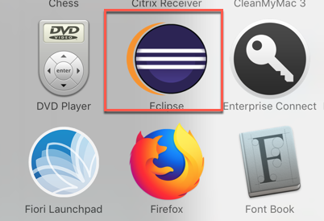

1. Specify your workspace directory and click **Launch**  
	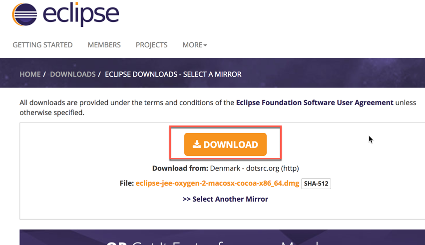

1. Disable the **Welcome page** and click on the **Workbench** button to go straight to your workbench  
	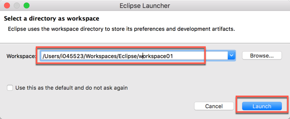

1. It's important for the next exercises to install an Eclipse plugin which allows us to easily manage **YAML** files. For this reason, click on **Help -> Eclipse Marketplace...**  
	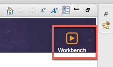

1. Enter the text "**yml**" in the search box and install the **YEdit** plugin  
	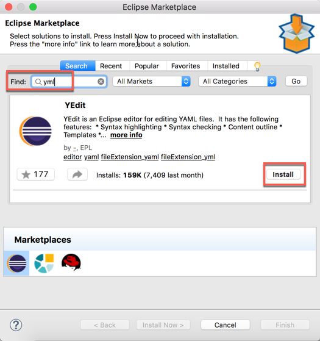

1. Accept the license agreement and click **Finish**
	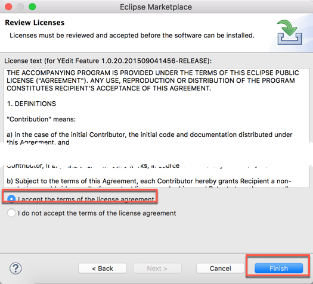

1. Click **Install anyway**  
	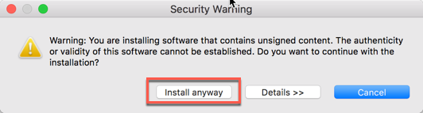

1. Restart Eclipse  
	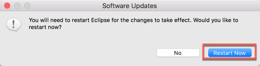

1. The configuration is complete!

### <a name="project-creation"></a> Create your first project
In this chapter you are going to create your first project using the S/4HANA Cloud SDK. This is just a "Hello World" project, which means that it's just a very basic Java application serving a page which displays a simple "Hello World" message. Let's start with this and you will learn how to modify this project in the next exercises.

1. Launch Eclipse IDE

1. Click on **File -> New -> Maven Project**  
	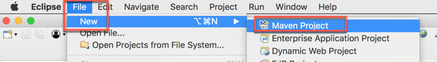

1. Click on **Next**  
	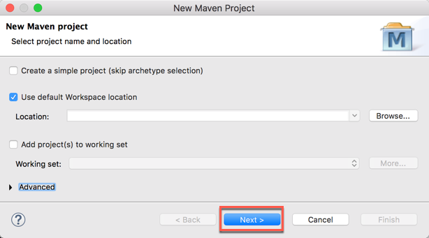

1. Since this is the first time we use the SDK we need to configure the Maven Central repository in Eclipse. Click **Configure**   
	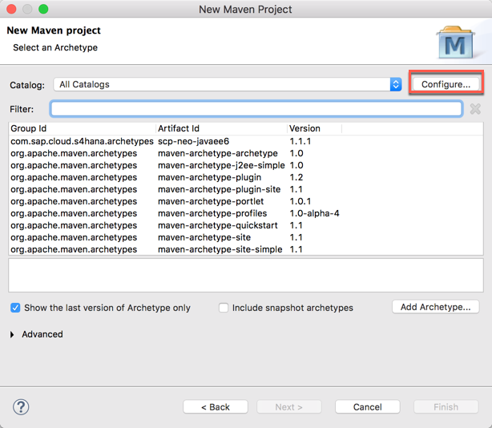

1. Click **Add Remote Catalog...**   
	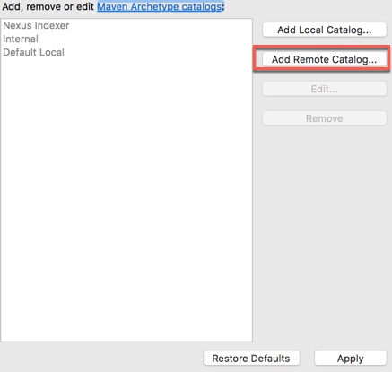

1. Enter the following values and ckick **OK**   

   Parameter			| Value   
	-------------		| -------------   
	Catalog File		| http://repo1.maven.org/maven2/   
	Description		| S4HANA Cloud SDK   

 	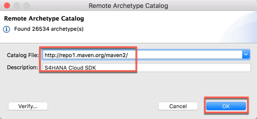

1. A new remote repository has been added, click on **Apply and Close**   
	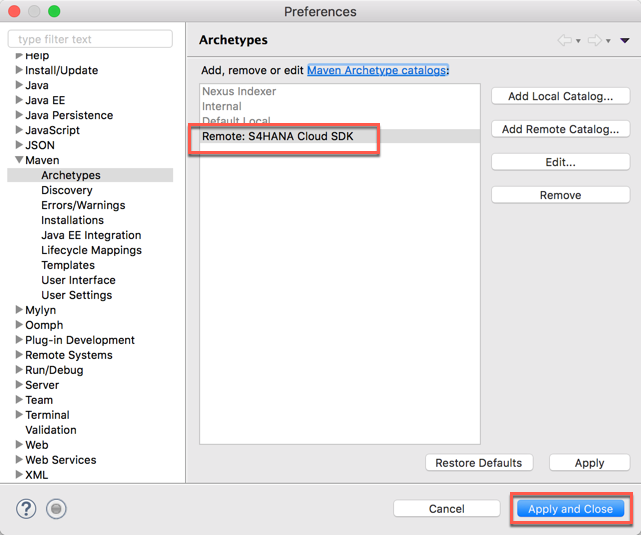

1. Type the text "**s4hana**" in the filter box and select the **scp-cf-tomee** artifact, then click **Next**   
	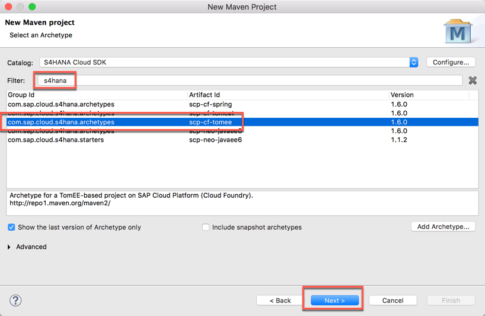

1. Set the following values replacing **xx** with the identifier received by your instructor and click **Finish**  

   Parameter 			| Value   
	-------------		| -------------   
	Group Id  		| com.sap.sample   
	Artifact Id		| bpr\_cf\_xx   
	Version			| 0.0.1-SNAPSHOT

 	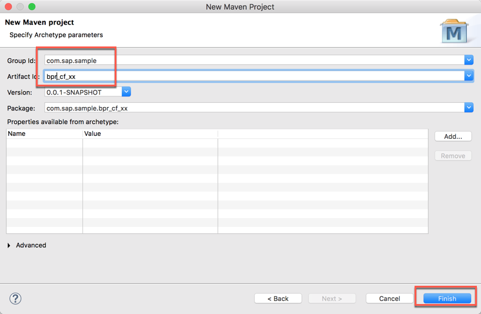
	
1. The project is created. Once done, expand the part related to the application and right click on the *pom.xml* file. Select **Run As -> Maven build**  
	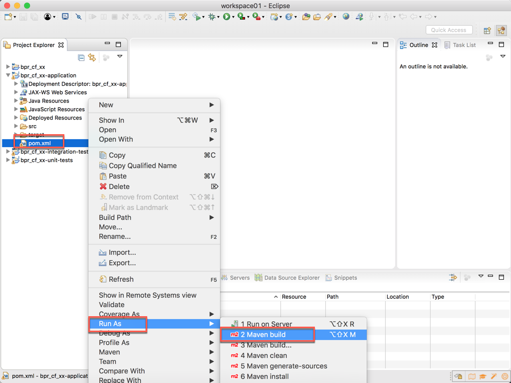

1. Enter the goals "clean install" and click **Run**  
	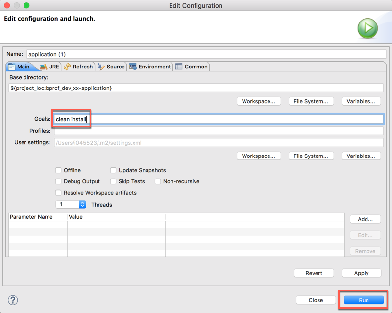

1. The project is built and you should receive a "BUILD SUCCESS" message  
	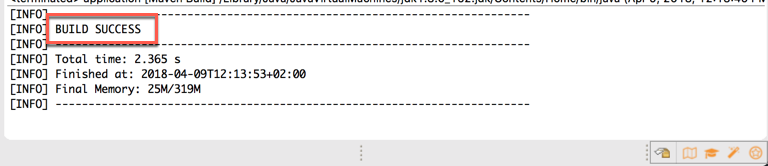


### <a name="deploy-to-cf"></a> Deploy the app to Cloud Foundry
Let's try to push the application to Cloud Foundry.

1. Login to your [SAP Cloud Platform Trial Landscape](https://account.hanatrial.ondemand.com/cockpit) and click on the **Cloud Foundry Trial** tile
	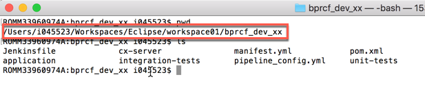

1. Click on the **trial** subaccount
	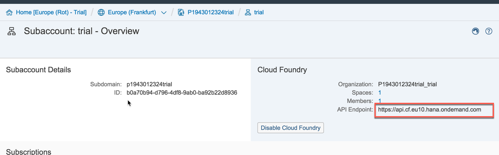

1. Write down or copy in the clipboard the endpoint to your Cloud Foundry space, since it will be required in the next steps. Then click on the small **1** indicating the number of available spaces: this will bring you to the list of all your spaces  
	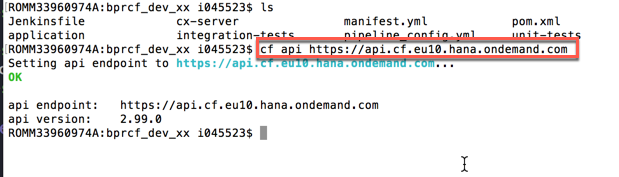

1. Click on the **dev** space (this is the default space assigned to you when you create an account on the Trial Landscape)
	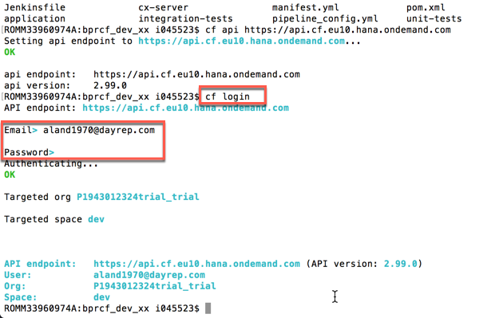

1. At moment your space does not contain any application yet
	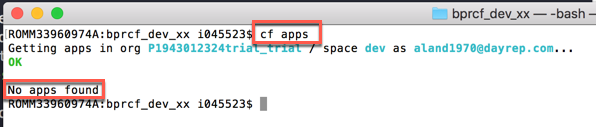

1. Open your Terminal or Command Prompt and navigate to the folder where the project is located. For example, mine is under *\<HOME\>Workspaces/Eclipse/workspace01/bpr\_cf\_xx* (**xx** must be replaced with your Workstation ID)  
	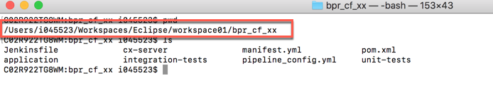

1. Enter the command

	```sh
	cf api <your_api_endpoint>
	```
where **\<your\_api\_endpoint\>** is the link you copied in the previous step
	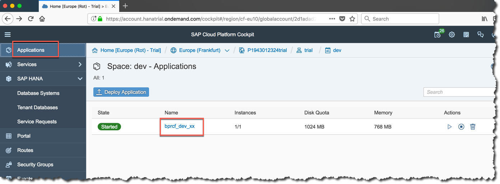

1. You can now login to Cloud Foundry with the command. You will have to enter the email you used to register to the SAP CP Trial Landscape with its password

	```sh
	cf login
	```	
	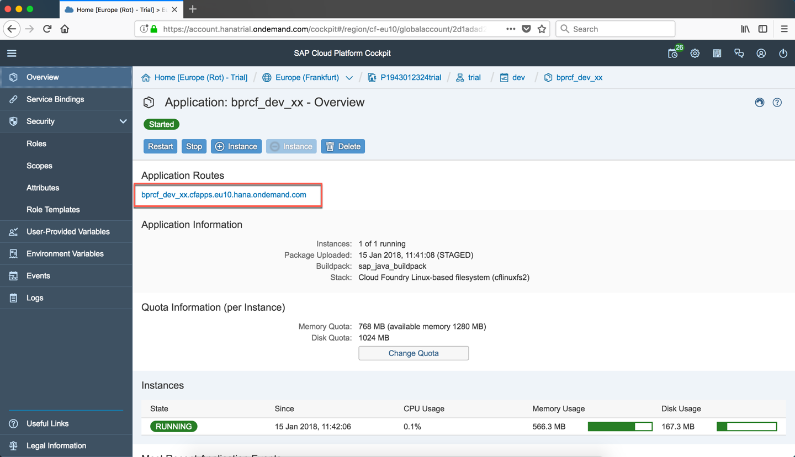

1. Make also sure that there are no other applications running in your CF environment so that you have plenty of space for this exercise  
	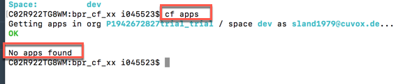

1. Enter the command `cf push` to deploy the application to your CF environment. At the end of the process you should get a status of "running" for your application and you should be also able to read the automatically generated random route for accessing it  
	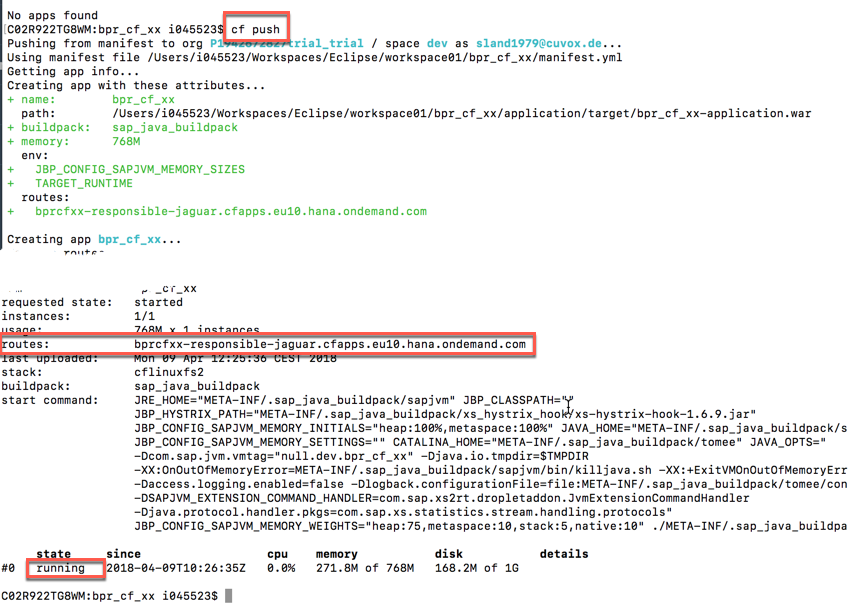

1. At the same way, you can check the result by accessing your SAP Cloud Foundry cockpit. You should see a new application in your space: click on the  application name  
	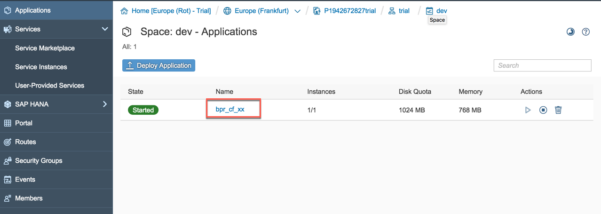

1. You will get a lot of other important details about your running application. Among those details, you will find the application route (the same you have seen in the Terminal two steps ago). Click on this route link and the application's landing page will be opened  
	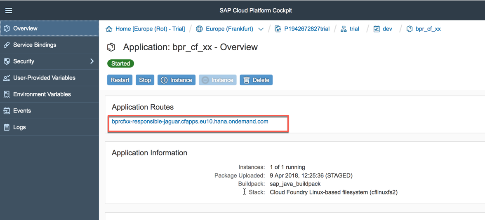

1. The application's landing page is just a standard Tomcat welcome screen  
	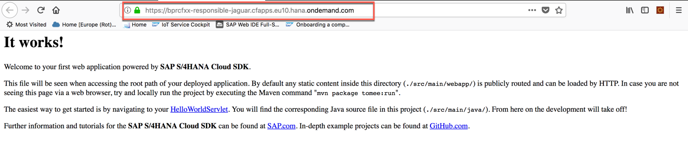

1. If you append to this URL the "/hello" endpoint you get your web service you defined within the Java application  
	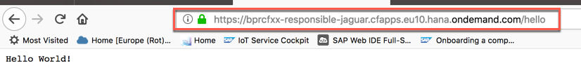

1. Congratulation! You have successfully created your CF application with Eclipse IDE.


## Summary
This concludes the exercise. You should have learned how to install and configure Eclipse IDE in order to create a SAP S/4HANA SDK project for Cloud Foundry from a Maven archetype. You have also learned how to build the project with this new IDE and how to deploy the application to your Cloud Foundry environment. Please proceed with the next exercise.
