<table width=100% border=>
<tr><td colspan=2><h1>EXERCISE 07 - RETRIEVING DATA FROM S/4HANA CLOUD SYSTEM AND SETTING UP THE INTEGRATION TESTS</h1></td></tr>
<tr><td><h3>SAP Partner Workshop</h3></td><td><h1> &nbsp;30 min</h1></td></tr>
</table>


## Description
In this exercise, you’ll learn how 

* to retrieve the list of Business Partners from a S/4HANA back-end by adding a couple of new Java classes to the application which will be consuming the S/4HANA Cloud SDK framework 
* to set a new Java class in the integration test module to check that the response, received from server when calling the new servlet, is a correct JSON output

For further reading on S/4HANA Cloud SDK, click link below.
<https://www.sap.com/germany/developer/topics/s4hana-cloud-sdk.html>


## Target group

* Developers
* People interested in learning about S/4HANA extension and SDK   


## Goal

The goal of this exercise is to retrieve some business partners data from the S/4HANA Cloud back-end using the S/4HANA Cloud SDK and check that the response is a valid JSON output.


## Prerequisites
  
Here below are prerequisites for this exercise.

* A trial account on the SAP Cloud Platform. You can get one by registering here <https://account.hanatrial.ondemand.com>
* Apache Maven
* Java JDK 8
* The source code created in the previous exercise
* A S/4HANA system with a working communication arrangment for the Business Partners collection


## Steps

1. [Retrieve Business Partner data from S/4HANA](#retrieve-bp-data)
2. [Setting up a destination service instance](#destination)
1. [Setting up an integration test for the Business Partners API](#integration-test)


### <a name="retrieve-bp-data"></a> Retrieve Business Partner data from S/4HANA
In this chapter you are going to see how to implement a couple of new JAVA classes to retrieve Business Partners data from a S/4HANA Cloud system.

1. Open Eclipse IDE and load the project created in the previous exercise  
	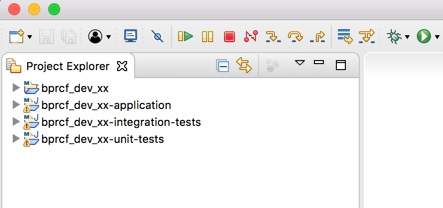

1. Double click on the *pom.xml* file in the **application** module to open it  
	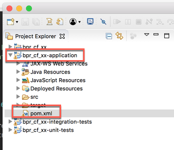

1. Select the **pom.xml** tab, paste the following **dependency** into this file at the end of other dependencies and **save** the file

	```xml
	<dependency>
		<groupId>org.projectlombok</groupId>
	   <artifactId>lombok</artifactId>
	</dependency>
	```

	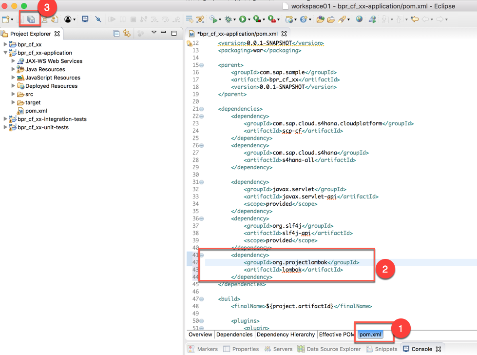

1. Right click on the application module and select **New -> Class** to create a new Java class  
	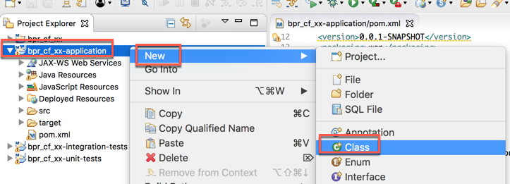

1. Check that the Package name is still *com.sap.sample.bpr\_cf\_xx* (**xx** must be replaced with your workstation ID) and enter the name **BPDetails** for this new class. Click **Finish**  
	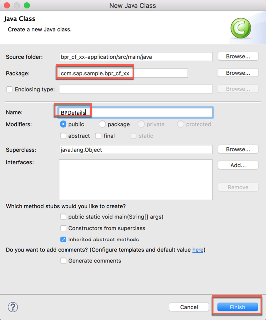

1. A new empty Java class is created  
	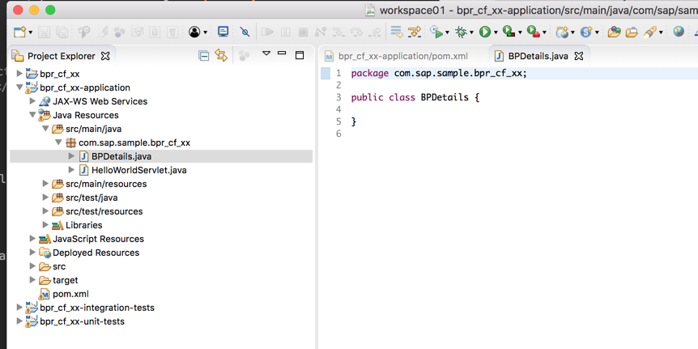

1. Replace the entire current content with the following (remember that **xx** must be replaced with your workstation ID) and **save** the file

	```java
	package com.sap.sample.bpr_cf_xx;
	
	import lombok.Data;
	import com.sap.cloud.sdk.result.ElementName;
	
	@Data
	public class BPDetails
	{
	    @ElementName( "BusinessPartner" )
	    private String bpId;
	
	    @ElementName( "BusinessPartnerName" )
	    private String bpName;
	
	    @ElementName( "BusinessPartnerCategory" )
	    private String bpCategory;
	
	    @ElementName( "BusinessPartnerGrouping" )
	    private String bpGrouping;
	
	    @ElementName( "LastName" )
	    private String bpLastName;
	
	    @ElementName( "FirstName" )
	    private String bpFirstName;
	}
	```

	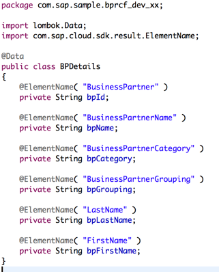

1. At the same way, create a new Java Class named **BPServlet** and click **Finish**  
	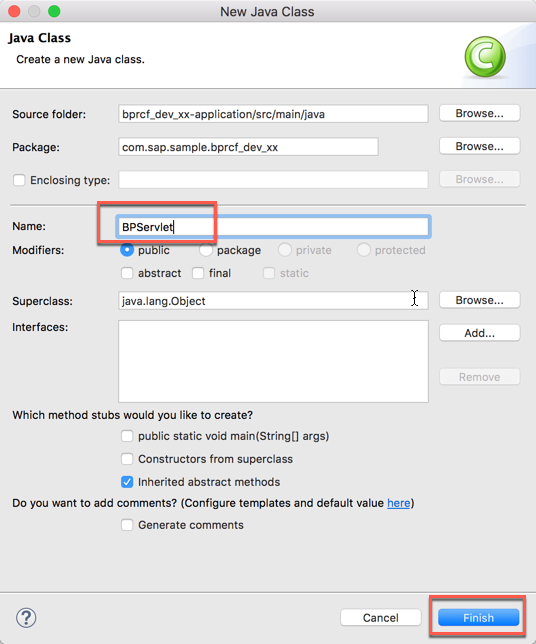

1. Replace the entire current content with the following (remember that **xx** must be replaced with your workstation ID)

	```java
	package com.sap.sample.bpr_cf_xx;
	
	import com.google.gson.Gson;
	import org.slf4j.Logger;
	import javax.servlet.ServletException;
	import javax.servlet.annotation.WebServlet;
	import javax.servlet.http.HttpServlet;
	import javax.servlet.http.HttpServletRequest;
	import javax.servlet.http.HttpServletResponse;
	import java.io.IOException;
	import java.util.List;
	import com.sap.cloud.sdk.odatav2.connectivity.ODataException;
	import com.sap.cloud.sdk.odatav2.connectivity.ODataQueryBuilder;
	import com.sap.cloud.sdk.s4hana.connectivity.ErpConfigContext;
	import com.sap.cloud.sdk.s4hana.connectivity.ErpDestination;
	import com.sap.cloud.sdk.s4hana.connectivity.ErpEndpoint;
	import com.sap.cloud.sdk.s4hana.serialization.SapClient;
	import com.sap.cloud.sdk.cloudplatform.logging.CloudLoggerFactory;
	
	@WebServlet("/businesspartners")
	public class BPServlet extends HttpServlet {
	
	    private static final long serialVersionUID = 1L;
	    private static final Logger logger = CloudLoggerFactory.getLogger(BPServlet.class);
	
	    @Override
	    protected void doGet(final HttpServletRequest request, final HttpServletResponse response)
	            throws ServletException, IOException
	    {
	        final SapClient sapClient = new SapClient("100"); // adjust SAP client to your respective S/4HANA system
	        try {
	            final ErpEndpoint endpoint = new ErpEndpoint(new ErpConfigContext(ErpDestination.getDefaultName(), sapClient));
	            final List<BPDetails> businessPartners = ODataQueryBuilder
	                    .withEntity("/sap/opu/odata/sap/API_BUSINESS_PARTNER", "A_BusinessPartner")
	                    .select("BusinessPartner", "BusinessPartnerName", "BusinessPartnerCategory", "BusinessPartnerGrouping", "LastName","FirstName")
	                    .top(100)
	                    .build()
	                    .execute(endpoint)
	                    .asList(BPDetails.class);
	            response.setContentType("application/json");
	            response.getWriter().write(new Gson().toJson(businessPartners));
	        } catch(final ODataException e) {
	            logger.error(e.getMessage(), e);
	            response.setStatus(HttpServletResponse.SC_INTERNAL_SERVER_ERROR);
	            response.getWriter().write(e.getMessage());
	        }
	    }
	}
	```
	
	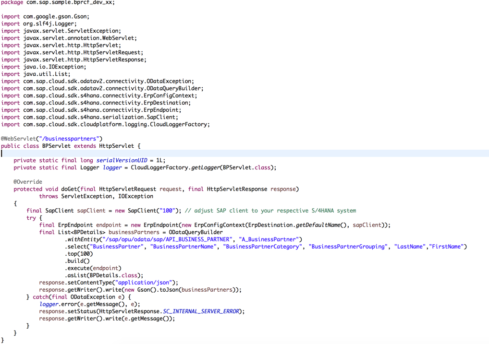

1. Save the file

1. Expand the **root** module of your project and select the *pom.xml* file. Then click on the small play button on the toolbar. Select the **Maven build** goal and click **OK**  
	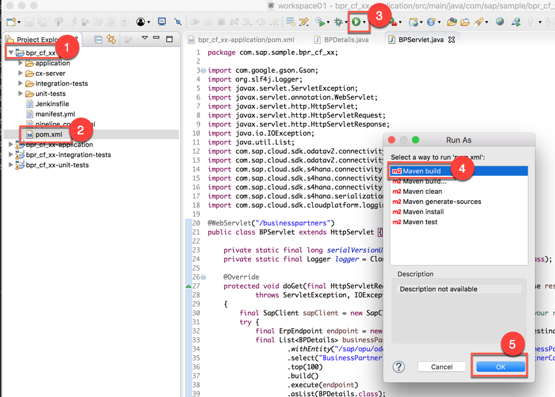

1. Specify the **clean install** goals if required and click **Run**  
	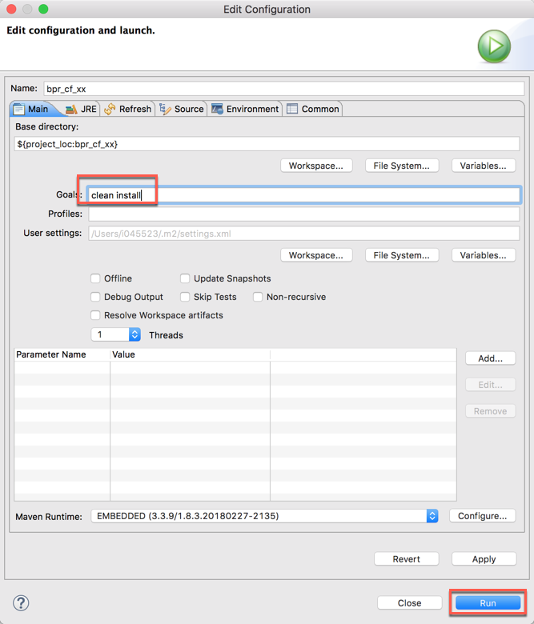

1. Building should end with a BUILD SUCCESS message  
	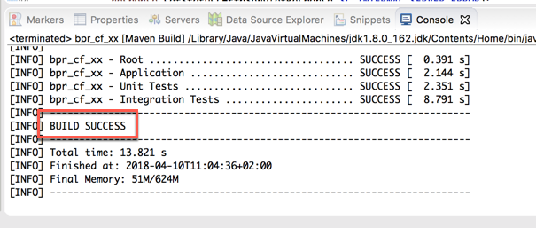

1. Open a terminal window and go to the project folder folder. Type in the `cf push` command to deploy the application to Cloud Foundry  
	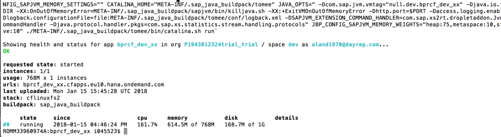

1. The push operation should finished successfully
	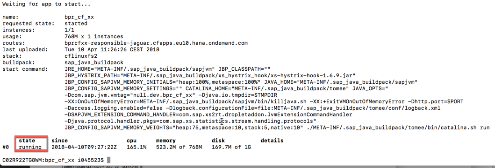

1. In order to run the application now, you need to take the random route, assigned to this application by the system, and put it in the browser with the following format 

	`https://<RANDOM_ROUTE>/businesspartners`

	where **businesspartners** is the endpoint you configured in the JAVA class. However, if you navigate to this URL now, it just returns an Internal Server Error, this because you have not yet defined a destination for your S/4HANA Cloud back-end
	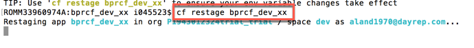

1. Continue with the next chapter where you will learn how to setup a destination service for your application.


### <a name="destination"></a> Setting up a destination service instance
To define a destination for our application we need two services from the marketplace: **Authorization & Trust** and **Destination**. Here you will learn how to get them properly configured.

1. Go to your **SAP CP Cockpit** and navigate to your Cloud Foundry space. Click on the name of your application  
	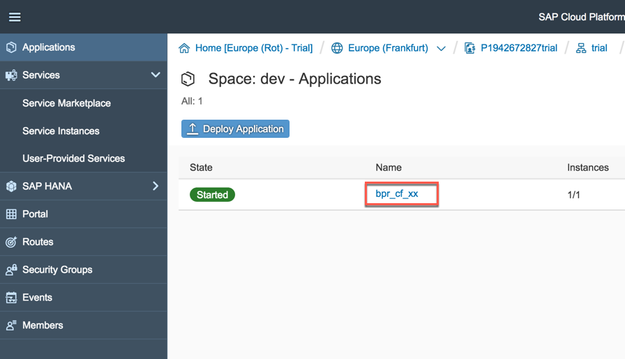

1. The first service instance we need is the **Authorization & Trust** service. Select **Service Bindings** and click on **Bind Service**  
	

1. Choose **Service from the catalog** and click **Next**  
	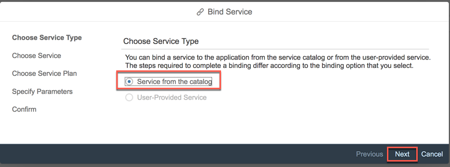

1. Select the **Authorization & Trust** service and click **Next**  
	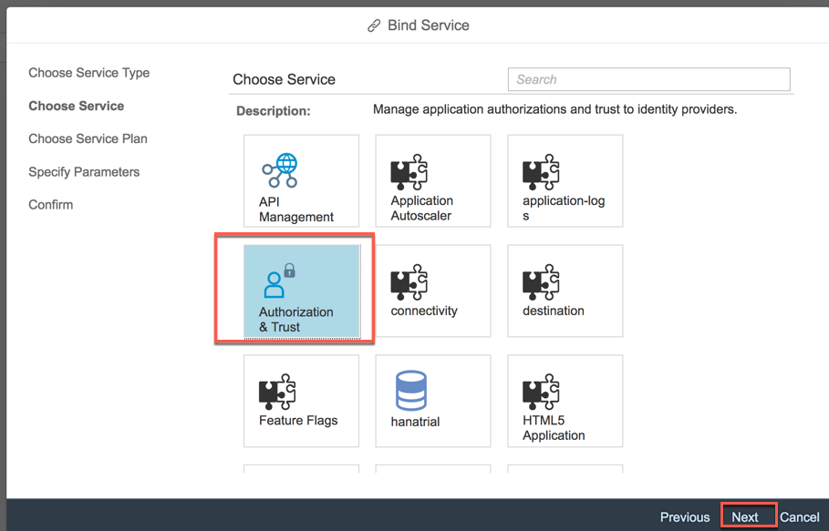

1. Select **Create new instance**, choose the **application** plan and click **Next**  
	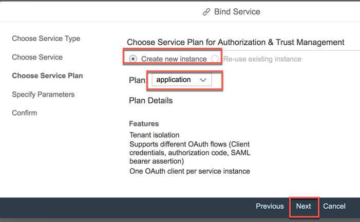

1. Click **Next**  
	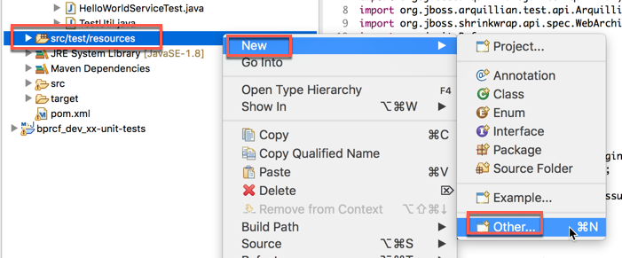

1. Enter **bpr_xsuaa** as **Instance Name** and click **Finish**
	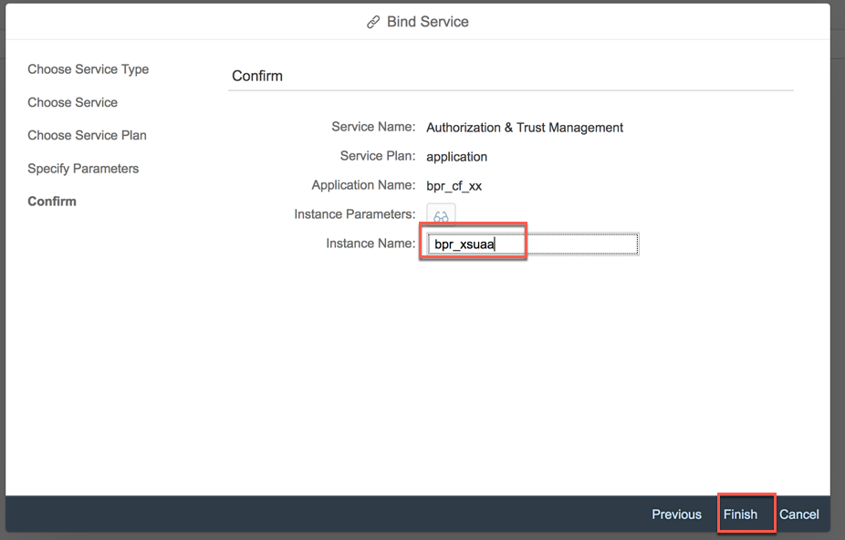

1. You should be able to see the created instance bound to your application. Now, you need to create an instance for the **Destination** service as well and bind it to your application. Click on the **Bind Service** button  
	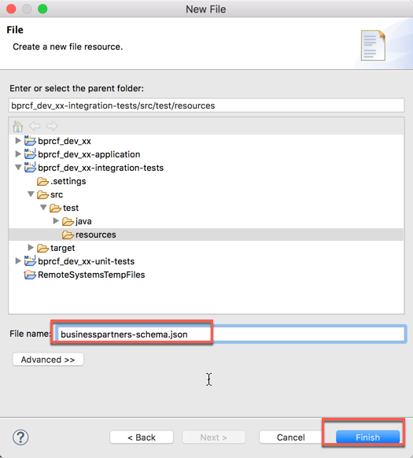
	
1. Choose **Service from the catalog** and click **Next**  
	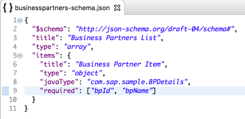

1. Select the **Destination** service and click **Next**  
	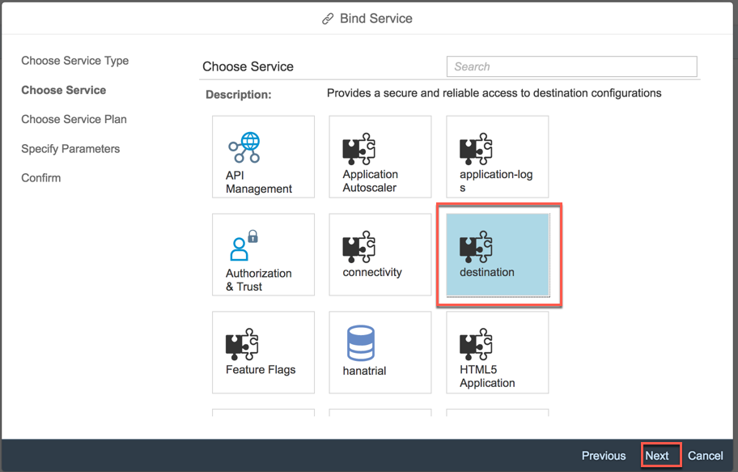

1. Select **Create new instance**, choose the **lite** plan and click **Next**  
	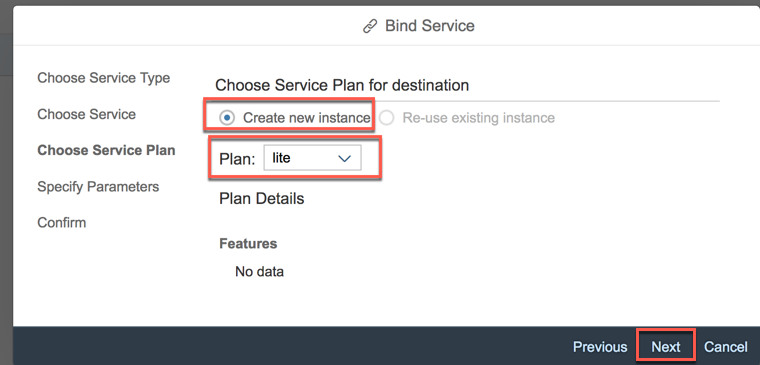

1. Click **Next**  
	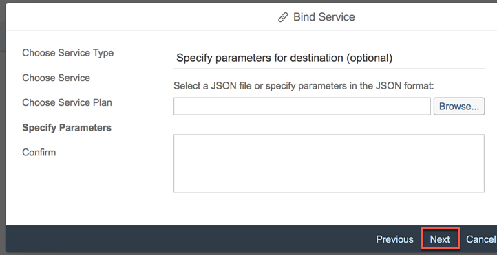

1. Enter **bpr_destination** as **Instance Name** and click **Finish**
	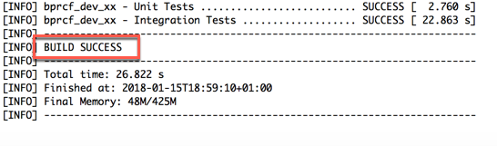

1. You have now an instance of the **Destination** service bound to your application. Click on the instance name (**bpr_destination**)  
	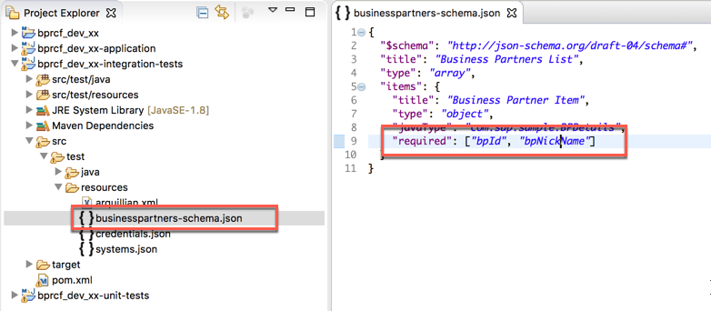

1. Select **Destinations (Beta)** on the left and click on **New Destination**  
	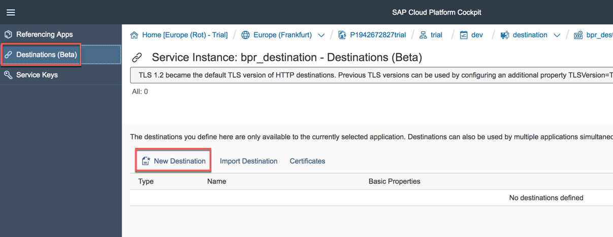

1. Enter the following values and click **Save**

	| Parameter | Value |
	| --------- | ----- |
	| Name | ErpQueryEndpoint |
	| Type | HTTP |
	| Description | ErpQueryEndpoint |
	| URL | \<S4HANA\_ENDPOINT\> |
	| Proxy Type | Internet |
	| Authentication | BasicAuthentication |
	| User | \<S4HANA\_USERNAME\> |
	| Password | \<S4HANA\_PASSWORD\> |

	>NOTE: The \<S4HANA\_ENDPOINT\>, \<S4HANA\_USERNAME\> and \<S4HANA\_PASSWORD\> have been provided to you by your instructor.  
	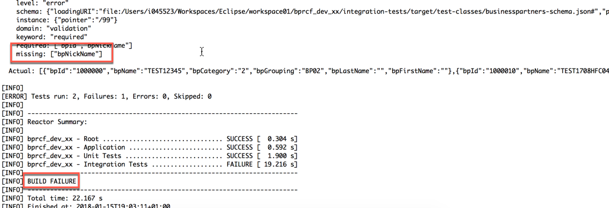

1. A new destination has been added to the list of the available destinations  
	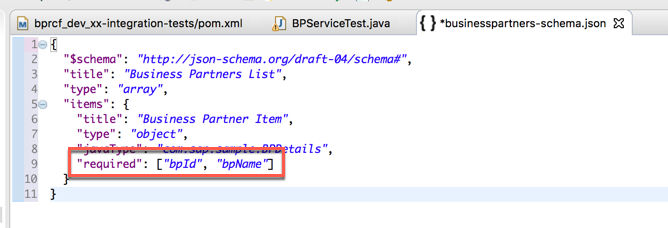
	
1. Once the destination has been saved you need to wait up to 5 minutes in order to have the changes applied to the system. In the meantime click on the "dev" space on the top toolbar to go back to your space  
	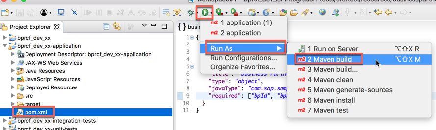

1. Once in your space, click on the application name  
	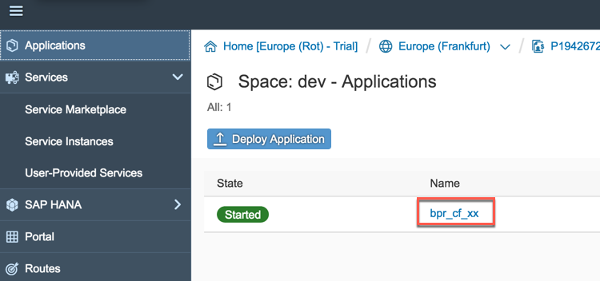

1. Click on the **Restart** button to restart your app and have the changes applied  
	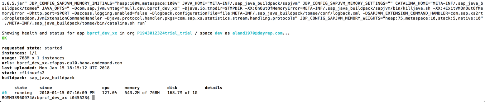

1. The application will pass from a status of "Starting" to "Started"  
	

1. If you refresh now the web page where you have put your application URL you should see some data  
	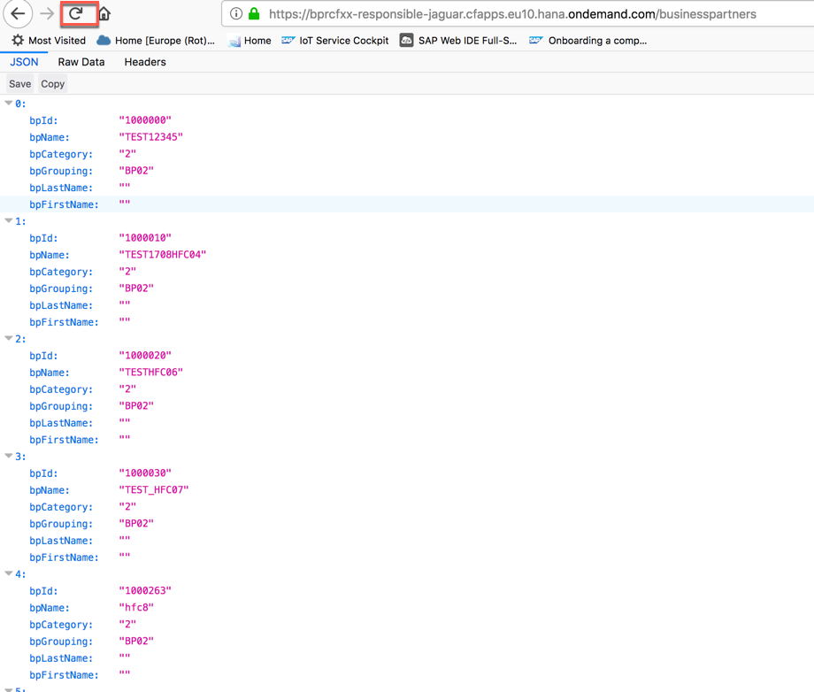

1. Now, in order to keep things aligned, you need to modify the *manifest.yml* file in your project so that any subsequent push operations will take into account the binding between your application and the 2 services. Go to Eclipse IDE and double click on the *manifest.yml* file in the main project (the first one). The file will be opened on the right
	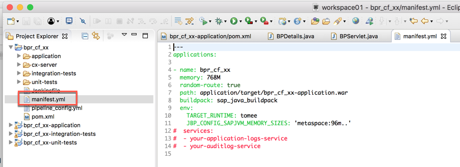

1. Add the lines 

	```yml
	  services:
	  - bpr-xsuaa
	  - bpr-destination
	```

	to your manifest file replacing the red ones. Your final file should look like this. Rememebr to **save** the file
	>NOTE 1: Please pay big attention to the indentattion of the lines you are adding because the YML files are pretty sensitive to this.
	
	>NOTE 2: If you want to copy & paste the following code, remember to replace **xx** with your workstation ID.
	
	```yml
	---
	applications:
	
	- name: bpr_cf_xx
	  memory: 768M
	  random-route: true
	  path: application/target/bpr_cf_xx-application.war
	  buildpack: sap_java_buildpack
	  env:
	    TARGET_RUNTIME: tomee
	    JBP_CONFIG_SAPJVM_MEMORY_SIZES: 'metaspace:96m..'
	  services:
	  - bpr-xsuaa
	  - bpr-destination
	```
	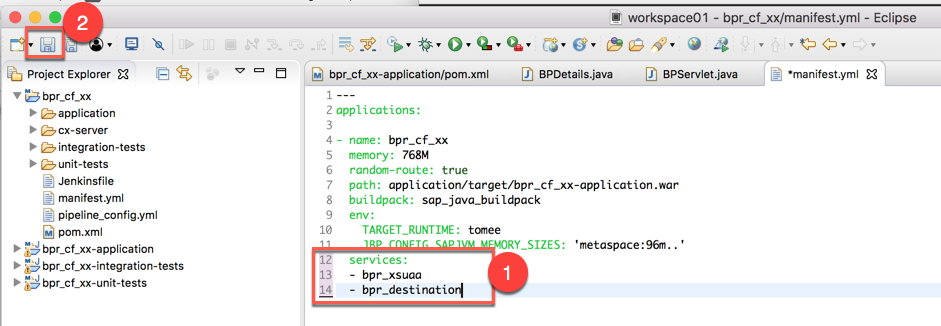

1. From your Terminal window run 

	```sh
	cf push
	```
	to push again your application to Cloud Foundry
	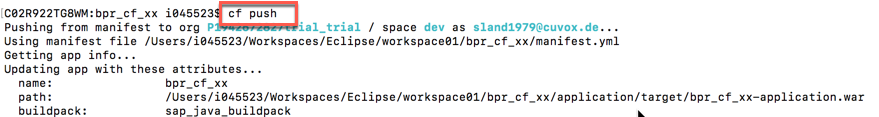

1. Refreshing the web page with your application URL make sure it's still returning some data  
	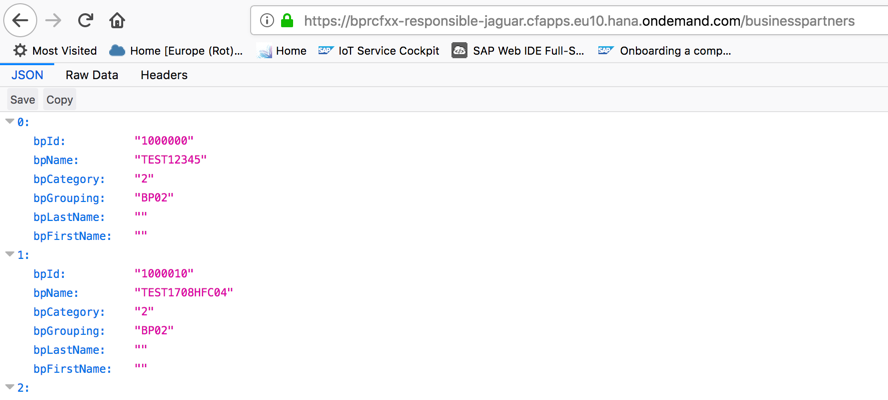

1. Congratulation! You have successfully setup a destination to the S/4HANA Cloud back-end system and retrieved Business Partners data with the S/4HANA Cloud SDK.


### <a name="integration-test"></a> Setting up an integration test for the Business Partners API
In this chapter you are going to implement a new Java class to test if the response coming from the back-end system is a valid JSON output and if the response contains the mandatory fields **bpId** and **bpName**.

1. Open Eclipse IDE, expand the **integration-tests** module and double click on the *pom.xml* file you can find under this branch. When a new tab opens, click on the **pom.xml** tab
	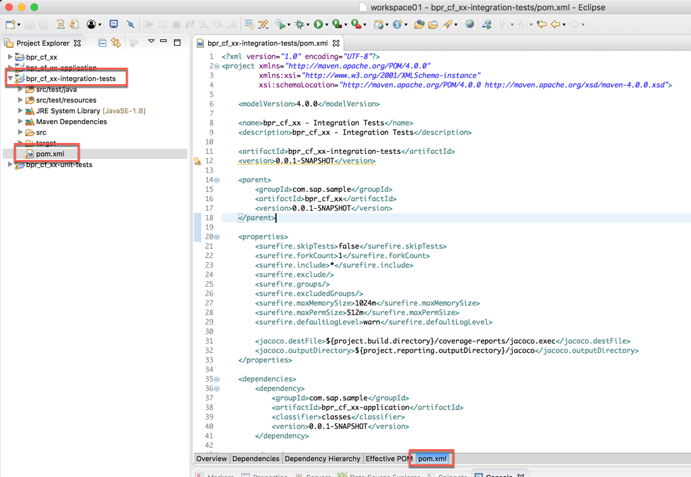

1. Add a new dependency to this module for the **Json Schema Validator**. Copy this code and paste it among all the other dependencies. Then **save** the file

	```xml
	<dependency>
	    <groupId>io.rest-assured</groupId>
	    <artifactId>json-schema-validator</artifactId>
	    <version>3.0.3</version>
	    <scope>test</scope>
	</dependency>
	``` 
    
	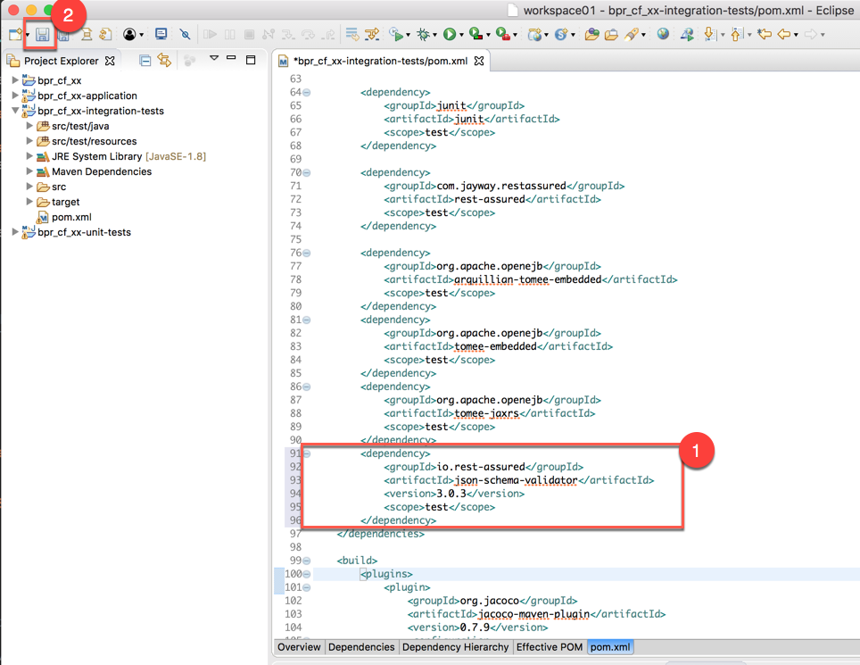

1. Right click on the **integration-tests** and choose **New --> Class**  
	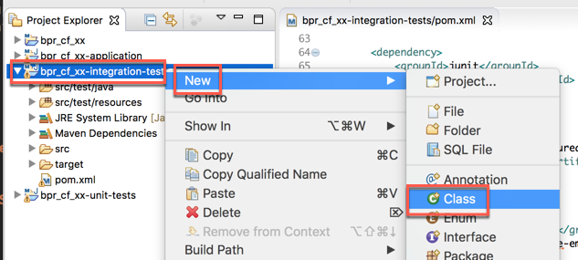

1. Create a new Java Class named **BPServiceTest** and click **Finish**  
	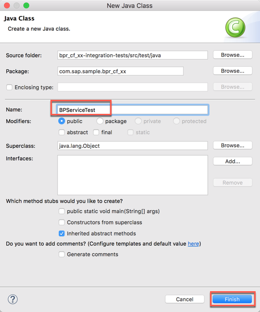

1. Paste in the following content and **save** the file (remember that **xx** must be replaced with your workstation ID)

	```java
	package com.sap.sample.bpr_cf_xx;
	
	import com.jayway.restassured.RestAssured;
	import com.jayway.restassured.http.ContentType;
	import io.restassured.module.jsv.JsonSchemaValidator;
	import org.jboss.arquillian.container.test.api.Deployment;
	import org.jboss.arquillian.junit.Arquillian;
	import org.jboss.arquillian.test.api.ArquillianResource;
	import org.jboss.shrinkwrap.api.spec.WebArchive;
	import org.junit.Before;
	import org.junit.BeforeClass;
	import org.junit.Test;
	import org.junit.runner.RunWith;
	import org.slf4j.Logger;
	
	import java.net.URL;
	import java.net.URISyntaxException;
	
	import com.sap.cloud.sdk.cloudplatform.logging.CloudLoggerFactory;
	import com.sap.cloud.sdk.testutil.MockUtil;
	
	import static com.jayway.restassured.RestAssured.given;
	
	@RunWith( Arquillian.class )
	public class BPServiceTest
	{
	    private static final MockUtil mockUtil = new MockUtil();
	    private static final Logger logger = CloudLoggerFactory.getLogger(BPServiceTest.class);
	
	    @ArquillianResource
	    private URL baseUrl;
	
	    @Deployment
	    public static WebArchive createDeployment()
	    {
	        return TestUtil.createDeployment(BPServlet.class);
	    }
	
	    @BeforeClass
	    public static void beforeClass() throws URISyntaxException
	    {
	        mockUtil.mockDefaults();
	        mockUtil.mockErpDestination();
	    }
	
	    @Before
	    public void before()
	    {
	        RestAssured.baseURI = baseUrl.toExternalForm();
	    }
	
	    @Test
	    public void testService()
	    {
	        // JSON schema validation from resource definition
	        final JsonSchemaValidator jsonValidator = JsonSchemaValidator.matchesJsonSchemaInClasspath("businesspartners-schema.json");
	
	        // HTTP GET response OK, JSON header and valid schema
	        given().
	                get("/businesspartners").
	                then().
	                assertThat().
	                statusCode(200).
	                contentType(ContentType.JSON).
	                body(jsonValidator);
	    }
	}
	```
	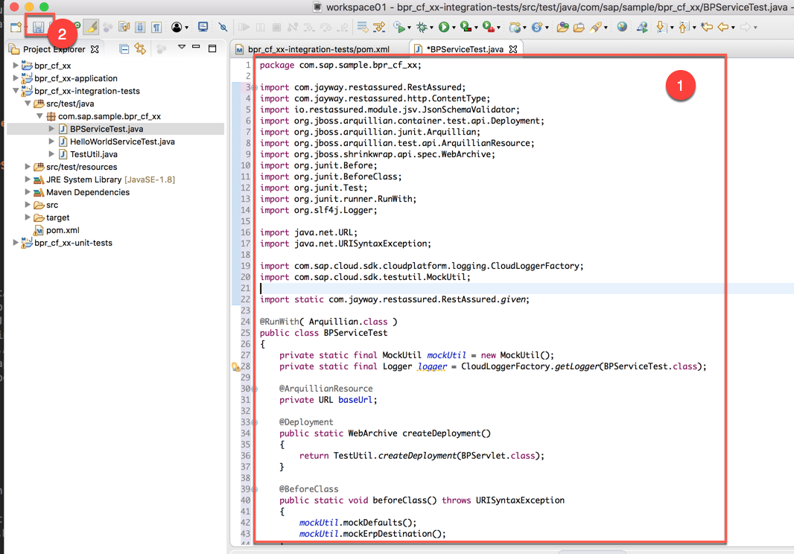

1. In the **integration-tests** module, right click on the *src/test/resources* folder and choose **New -> Other**  
	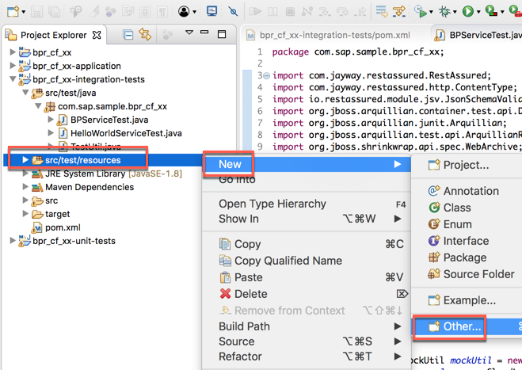

1. Select **General -> File** and click **Next**    
	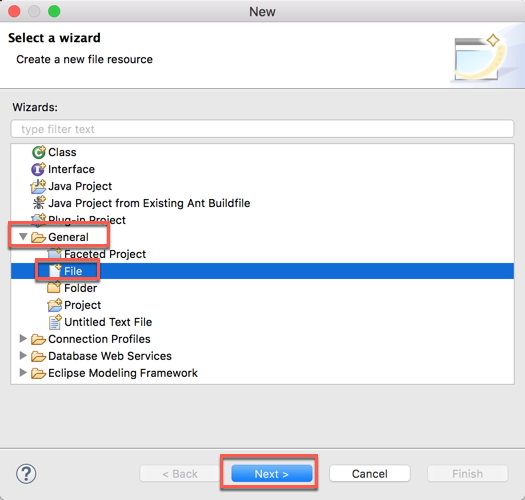

1. Create a new JSON file named *businesspartners-schema.json* and click **Finish**
	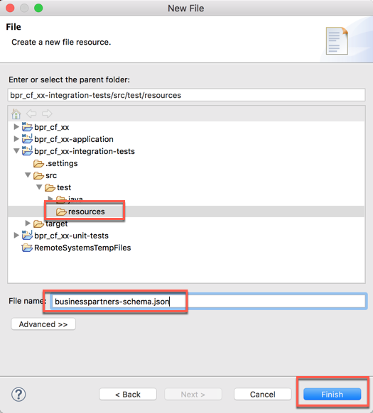

1. Paste in this JSON fragment and **save** the file  

	```json
	{
	  "$schema": "http://json-schema.org/draft-04/schema#",
	  "title": "Business Partners List",
	  "type": "array",
	  "items": {
	    "title": "Business Partner Item",
	    "type": "object",
	    "javaType": "com.sap.sample.BPDetails",
	    "required": ["bpId", "bpName"]
	  }
	}
	```
	
	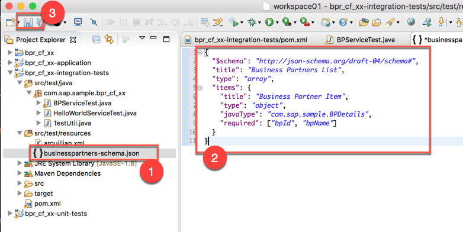

1. Staying in the same path, create a new JSON file named *systems.json* as you have done in the previous step    
	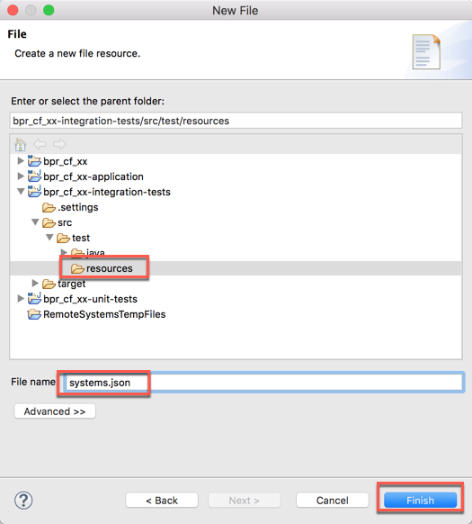

1. Paste in the following content replacing the placeholder for the S/4HANA Cloud Endpoint and save the file. As URI string we are using the API Endpoint of the S/4HANA Cloud back-end system  
	>NOTE: The \<S4HANA\_ENDPOINT\> has been provided to you by your instructor.  

	```json
	{
	  "erp": {
	    "default": "ERP",
	    "systems": [
	      {
	        "alias": "ERP",
	        "uri": "\<S4HANA\_ENDPOINT\>"
	      }
	    ]
	  }
	}
	```

	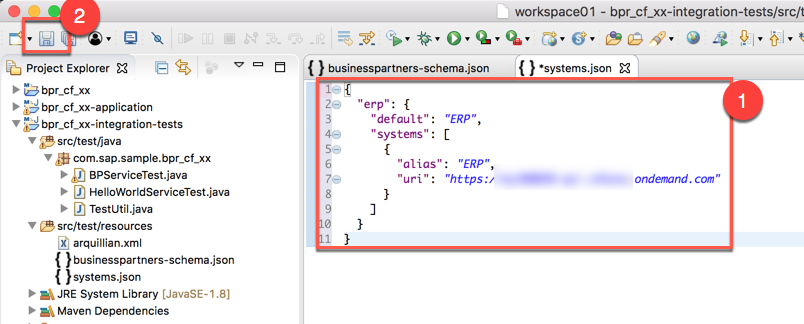

1. Remaining in the same path, create again a new JSON file named *credentials.json*  
	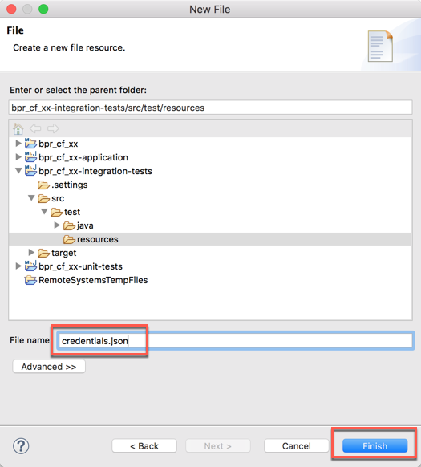

1. Paste in the following content replacing the placeolders for username and password and save the file: the credentials used here are the ones for the URI specified in the previous step   
	>NOTE: The \<S4HANA\_USERNAME\> and \<S4HANA\_PASSWORD\> have been provided to you by your instructor.  

	```json
	{
	  "credentials": [
	    {
	      "alias": "ERP",
	      "username": "\<S4HANA\_USERNAME\>",
	      "password": "\<S4HANA\_PASSWORD\>"
	    }
	  ]
	}
	```

	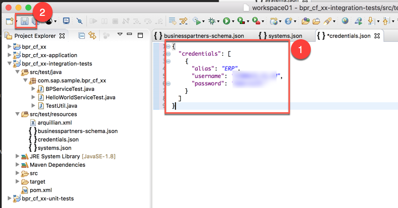

1. Remember to save all the files you have created so far

1. Now, in order to run just the Maven **test** goal, expand the **root** module, right click on the *pom.xml* file and select the **Run As -> Maven test** goal  
	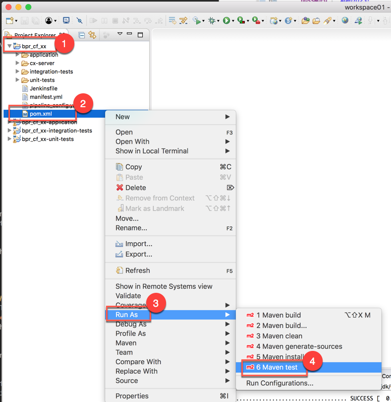

1. At the end of the execution, you should receive a BUILD SUCCESS message. This means that your data source output has been verified against the conditions we have set  
	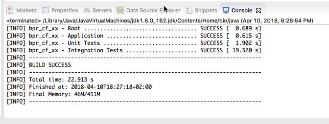

1. For example, if you want to verify that the integration test is working, try by replacing in the *businesspartners-schema.json* file, the string **bpName** with **bpNickName**. In this way we are telling to the integration-test phase that we are expecting as mandatory fields **bpId** and **bpNickName**. Since this last field doesn't exist, the integration test should fail  
	

1. Remember to save the file and execute the Maven **test** goal again 

1. The test, as expected, fails and if you scroll up the Terminal pane, you see the message informing you that an object is missing required properties  
	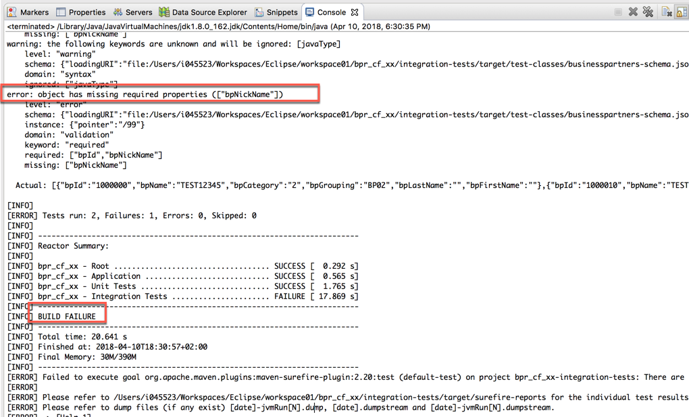

1. Restore the original **bpName** value and save the file  
	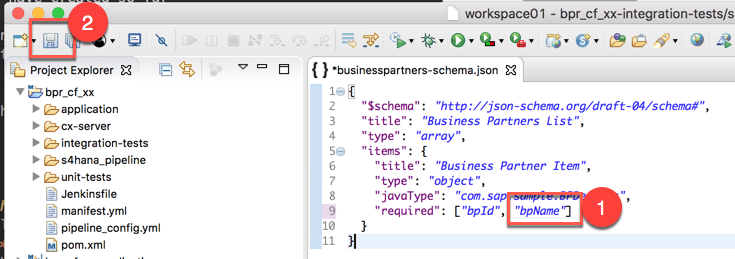

1. Expand the **root** module of your project and select the *pom.xml* file. Then click on the small play button on the toolbar. Select the **Maven build** goal and click **OK**  
	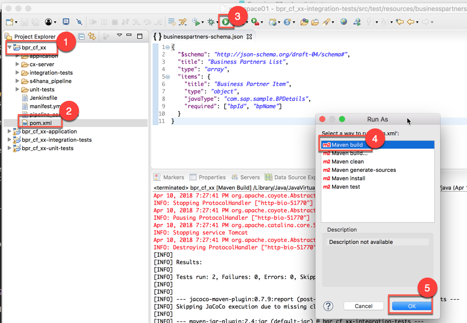

1. Specify the **clean install** goals if required and click **Run**  

1. Build should succeed  
	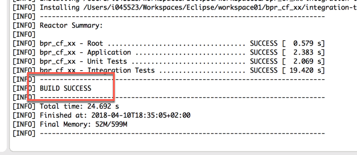

1. In the Terminal pane, run again a `cf push` command to Cloud Foundry  
	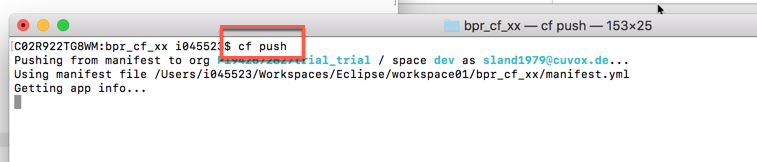

1. Check that the application is still providing the expected results    
	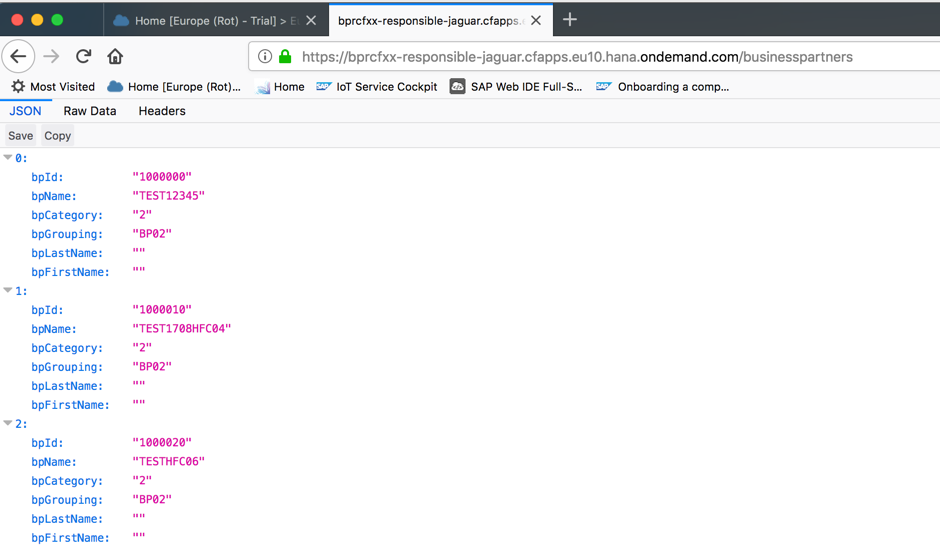

1. Congratulation! You have successfully implemented integration tests into your application using the S/4HANA Cloud SDK.


## Summary
This concludes the exercise. You should have learned how to retrieve data from a S/4HANA back-end system and how to implement integration testing using the S/4HANA Cloud SDK. Please proceed with the next exercise.
